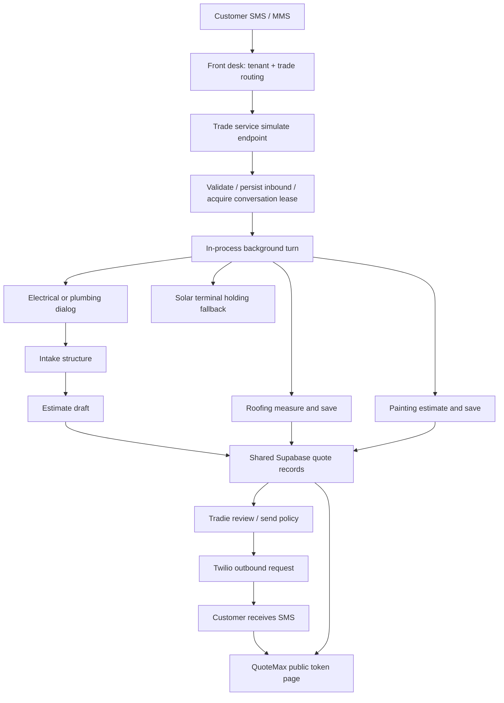

# QuoteMax SMS receptionist reliability audit
Date: 8 September 2026  
Verdict: **FAIL — stability and reliable quote delivery are not established.**

## Executive finding

The symptoms are consistent with integration and workflow defects, not simply a weak AI prompt. The fleet can acknowledge a message without durably scheduling its work, lose a follow-up during a long turn, mistake an intake for a completed quote, record an unsuccessful send as an outbound reply, and emit a roofing quote link whose database insert failed. The solar receptionist's shared-dialog entry point deliberately ends the conversation with a promise instead of starting an estimate.

**25 findings are recorded below.** Each distinguishes a reproduced defect, a source-confirmed defect, or a conditional configuration risk. The report is an inventory of problems found in this evaluation; it is not a claim that every defect in every platform feature has been discovered.

This audit produced a report and offline reproduction evidence. **Production application code, deployments, webhook settings, customer messages, and database rows were not changed. The receptionists have not been repaired or certified stable.**

## Scope and evidence

Platform: `C:/Users/dalig/Downloads/QuoteMate/quoteMate`, baseline HEAD `0b652e60dc1070a4d5fa0f54990fcb1a4fbee402`. App: `quotemate-automation/`.

Fleet: `C:/Users/dalig/Desktop/MaintainTech/MaintainOrg/QuoteMax/Receptionists`.

| Service | Baseline commit | TypeScript source files | Identical platform library copies | Different platform library copies | Service-only library files |
|---|---|---:|---:|---:|---:|
| Front desk | d1859c0 | 26 | 0 | 0 | 0 |
| Electrical | 0953181 | 213 | 96 | 93 | 1 |
| Plumbing | 01490a7 | 208 | 144 | 37 | 4 |
| Roofing | f6aa647 | 226 | 156 | 43 | 4 |
| Painting | 8013940 | 234 | 163 | 45 | 3 |
| Solar | 428efa5 | 211 | 147 | 40 | 1 |

Copy counts compare same-relative-path files under each service's `src/lib` with platform `lib`. Differences include intentional export transformations; **a difference is not automatically a bug**. Concrete behavioural drift is documented separately. These are local working-copy snapshots, not verified deployed commit identifiers. Plumbing, roofing and painting had existing uncommitted changes; the platform also had unrelated changes. They were preserved.

The evaluation inventoried all six services, inspected the ingress/router, service adapters, conversation lifecycle, locks, intake and estimate handoffs, quote persistence, token pages, outbound dispatch, approval/holding behaviour, export process, and relevant tradie tool integrations. The full configured platform unit suite was run. This is **not** a manual line-by-line security review of every UI, migration, billing feature and third-party integration.

### Verification performed

| Check | Result | What it establishes |
|---|---|---|
| Full platform Vitest suite | **8,370 passed, 0 failed, 24 skipped**; 8,394 cases total | Existing local tests pass with live DB/model/refinement switches disabled |
| Focused SMS/intake/quote/Twilio/estimation suite | **2,422 passed, 0 failed, 7 skipped** | Focused baseline; subset of the full run, not additional independent coverage |
| Platform TypeScript check | Passed | Current platform type consistency |
| All six service TypeScript checks | Passed | Local service type consistency |
| Front-desk routing source checks | **41 passed** | Existing deterministic router cases |
| Front-desk `npm run check` | Could not build: local `nest` executable unavailable | Packaging/build command is not a passed gate; source checks ran separately with platform's installed `tsx` |
| New offline defect probes | **5 reproductions succeeded** | Solar terminal fallback; stale router ownership; untrusted URL passthrough; roofing save/send failure on platform and service |
| Public fleet `/api/health/deep` | All six returned HTTP 200, `ok:true`, no missing required variables | Services reachable and required values nonempty |
| Public quote host in service health | All five trade services reported `https://quotemax.com.au` | Wrong-host fallback is **not observed** in current health output |
| Production SMS/quote incident replay | Not performed | No failing URL, message SID or time-correlated incident was available during this audit |

No real customer SMS, model request, payment or quote was generated by verification. The offline probes stub pricing, measurement, persistence and sending. A successful reproduction means **the defect occurred**, not that the behaviour is correct.

The GitNexus index was refreshed to the platform checkout: 59,770 nodes, 158,070 edges, 214 reported flows. Its own analysis reported skipped large files and truncated process discovery. File-disambiguated impact analysis of `measureAndDispatchRoofing` returned **UNKNOWN**, with no callers resolved. This is not an all-clear. Source confirmation found callers in SMS inbound, public quote-request submission, and voice handover. Those paths all belong in regression coverage. The external fleet is not included in that platform graph.

Evidence: [test reports, logs and offline reproduction script](C:/Users/dalig/.codex/visualizations/2026/09/08/01a07f99-45aa-7301-bf72-b1e946ed3015). Specific files are listed at the end.

## Integration map

The services and website share records but do not share one executing code version. Railway owns exported dialog/engine copies; QuoteMax owns public quote pages and dashboard/form tooling. A database contract or pricing change can therefore land on one side without the other.

## Prioritised findings

P1 = material customer loss, inaccessible/wrong quote, or sensitive integration failure. P2 = recovery, observability or conditional configuration defect that materially impairs reliability.

### F01 — P1 — Roofing sends a quote link even when saving the quote fails
**Status:** Reproduced offline in platform and roofing service.

**Cause/evidence:** [lib/sms/roofing-measure-dispatch.ts:152](C:/Users/dalig/Downloads/QuoteMate/quoteMate/quotemate-automation/lib/sms/roofing-measure-dispatch.ts:152) and [qm-roofing-receptionist/src/lib/sms/roofing-measure-dispatch.ts:142](C:/Users/dalig/Desktop/MaintainTech/MaintainOrg/QuoteMax/Receptionists/qm-roofing-receptionist/src/lib/sms/roofing-measure-dispatch.ts:142) await the insert but never inspect its returned `error`. Supabase can resolve with `data:null,error:{...}`; this does not enter the catch. The function still sends `/q/roof/<new-token>` and returns success. The website needs that token in `roofing_measurements` and otherwise calls `notFound()`: [app/q/roof/[token]/page.tsx:193](C:/Users/dalig/Downloads/QuoteMate/quoteMate/quotemate-automation/app/q/roof/[token]/page.tsx:193).

**Required fix:** Require a successful insert returning the persisted ID and public token before any customer link/MMS. Propagate database failures as typed failures and schedule recoverable work. Never advance the conversation to a measured/quoted state on save failure.

**Acceptance:** Inject resolved insert errors, missing rows and transport errors. No link is sent for any failed save; one persisted token is reused after recovery.

### F02 — P1 — The solar SMS receptionist has no functioning quote-dialog handoff
**Status:** Terminal behaviour reproduced; missing solar integration confirmed in inspected route.

**Cause/evidence:** [qm-solar-receptionist/src/lib/sms/service-dialog.ts:25](C:/Users/dalig/Desktop/MaintainTech/MaintainOrg/QuoteMax/Receptionists/qm-solar-receptionist/src/lib/sms/service-dialog.ts:25) sets `DIALOG_TRADES=null`. Its `decideNextTurn` returns `end_conversation`, `ready_for_intake:false`, and a promise that the team will sort a quote. The solar inbound route has no dedicated solar estimate branch to replace that fallback. Its exported generic intake schema only admits electrical/plumbing: [qm-solar-receptionist/src/lib/intake/schema.ts:9](C:/Users/dalig/Desktop/MaintainTech/MaintainOrg/QuoteMax/Receptionists/qm-solar-receptionist/src/lib/intake/schema.ts:9). The front desk nevertheless routes solar enquiries there.

**Required fix:** Connect a solar-specific conversation contract to the existing solar estimator, persisted `solar_estimates.public_token`, and website `/q/solar/<token>` workflow. Provide status and resend operations. Until this is implemented, use an honest persisted human handoff with a real notification, not an imminent quote promise.

**Acceptance:** Fresh solar enquiry → required facts → durable estimate → correct tenant/token → customer-visible result; resend returns the same result without another estimate. Failures must produce an actionable recovery state.

### F03 — P1 — Acknowledged work does not survive process loss
**Status:** Source-confirmed architectural defect across the five services.

**Cause/evidence:** [qm-electrical-receptionist/src/runtime/after.ts:8](C:/Users/dalig/Desktop/MaintainTech/MaintainOrg/QuoteMax/Receptionists/qm-electrical-receptionist/src/runtime/after.ts:8) keeps promises only in an in-memory set. The webhook returns success while work runs in this shim. A crash or forced deployment termination loses work. The persisted inbound SID remains, so ordinary redelivery can be suppressed as a duplicate. Draining promises on SIGTERM is helpful but is not durable recovery. Platform handoffs also use `after()`.

**Required fix:** Atomically persist inbound receipt plus a durable job before acknowledgement. Run recoverable workers with checkpoints, retries and dead-letter escalation. Deduplicate message receipt separately from completion of work.

**Acceptance:** Kill a worker after acknowledgement at each pipeline stage, restart, and prove exactly one completed draft and one intended outbound job.

### F04 — P1 — Follow-ups arriving during a turn can remain unanswered
**Status:** Source-confirmed across all copied inbound routes.

**Cause/evidence:** [app/api/sms/inbound/route.ts:2343](C:/Users/dalig/Downloads/QuoteMate/quoteMate/quotemate-automation/app/api/sms/inbound/route.ts:2343) persists a follower message, fails the lock claim and acknowledges it. The leader reads history once near the start. Its final drain, [app/api/sms/inbound/route.ts:4567](C:/Users/dalig/Downloads/QuoteMate/quoteMate/quotemate-automation/app/api/sms/inbound/route.ts:4567), does not process those messages; it only attempts a generic acknowledgement for an active roofing thread with an unexpired lease. Electrical, plumbing, painting and solar do not get even that handling. Releasing the lock does not schedule the stored message.

**Required fix:** Track the last processed inbound ID/sequence. Drain or enqueue every later inbound in order after each turn, including after draft completion. Preserve burst coalescing without dropping the later work.

**Acceptance:** Send a correction, price question and “send the link again” before history load, after history load, during drafting and just before lock release. Every message must be handled once.

### F05 — P1 — The conversation lock can be released by its previous owner
**Status:** Source-confirmed across the five services and platform fallback.

**Cause/evidence:** The lease lasts 60 seconds, while measurement/drafting can take longer. Completion updates `processing_until:null` using only conversation ID: [app/api/sms/inbound/route.ts:4640](C:/Users/dalig/Downloads/QuoteMate/quoteMate/quotemate-automation/app/api/sms/inbound/route.ts:4640). If worker B acquires the expired lease while A is still running, A can clear B's lease. The “stillOwnLock” check only tests whether a future timestamp exists; it can mistake B's lease for A's.

**Required fix:** Add an owner/attempt token or fencing version, renew leases while working, and require that token on state writes and release. Do not process without exclusivity when lock infrastructure fails.

**Acceptance:** A runs beyond 60 seconds; B acquires; A completes. A cannot send or overwrite B's state or clear B's lease. A third message cannot create a third concurrent owner.

### F06 — P1 — Intake existence is mistaken for quote completion
**Status:** Source-confirmed.

**Cause/evidence:** [lib/sms/quote-already-drafted.ts:54](C:/Users/dalig/Downloads/QuoteMate/quoteMate/quotemate-automation/lib/sms/quote-already-drafted.ts:54) suppresses drafting whenever `intake_id` exists. [app/api/intake/structure/route.ts:790](C:/Users/dalig/Downloads/QuoteMate/quoteMate/quotemate-automation/app/api/intake/structure/route.ts:790) links that ID and marks the conversation done before estimate work finishes. Its short-circuit at line 238 returns success for a recent intake without ensuring an estimate job/quote exists. An estimate failure leaves the same intake linked; retrying the customer turn can therefore keep suppressing the missing quote.

**Required fix:** Represent intake, estimate job, saved quote, review and delivery as separate durable stages. Resume from the first incomplete stage using the same intake. A quote-exists check must use the quote/job record, not the intake foreign key.

**Acceptance:** Fail immediately after intake insertion and during estimate dispatch. A subsequent retry/status request resumes work and does not indefinitely promise an absent quote.

### F07 — P1 — Estimate dispatch can create duplicate initial quotes on retry
**Status:** Source-confirmed retry/idempotency gap.

**Cause/evidence:** Intake retries its `/api/estimate/draft` request after failure: [app/api/intake/structure/route.ts:1027](C:/Users/dalig/Downloads/QuoteMate/quoteMate/quotemate-automation/app/api/intake/structure/route.ts:1027). The draft route generates a fresh token and inserts a new quote each invocation: [app/api/estimate/draft/route.ts:566](C:/Users/dalig/Downloads/QuoteMate/quoteMate/quotemate-automation/app/api/estimate/draft/route.ts:566). No initial-estimate attempt key or existing-quote claim protects that insert. The parent/child quote-chain index in migration 194 protects a different operation.

**Required fix:** Use a durable estimate-attempt/idempotency key and transactional claim. Replayed responses return the existing quote/job. Keep explicit revisions and final/balance child quotes as distinct authorised operations.

**Acceptance:** Repeat and concurrently submit the same estimate request, including a response lost after commit. One initial quote and one customer delivery job result.

### F08 — P1 — No authoritative general “resend my quote” operation
**Status:** Source-confirmed capability gap; solar resend failure reproduced.

**Cause/evidence:** General dialog relies on transcript links and the optional manual-follow-up pin: [lib/sms/followup-context.ts:106](C:/Users/dalig/Downloads/QuoteMate/quoteMate/quotemate-automation/lib/sms/followup-context.ts:106) and [lib/sms/dialog.ts:2034](C:/Users/dalig/Downloads/QuoteMate/quoteMate/quotemate-automation/lib/sms/dialog.ts:2034). There is no common tool that resolves the customer's existing quote across quote families by tenant and customer, reports its actual state, then returns its canonical URL. A new conversation after the completion grace window may not contain the old link. Roofing/painting have specialised state, but no shared operation covers the whole fleet.

**Required fix:** Implement a read-only quote lookup/status tool and a deterministic resend action scoped to tenant plus customer ownership. Store resource type, record ID and token; ask which job if multiple matches are plausible. Permit resends only according to existing review/publishing policy.

**Acceptance:** Resend works immediately, hours later, after restart, after a new conversation and after a manual tradie follow-up. It does not reprice, duplicate a quote or disclose another customer's link.

### F09 — P1 — URL repair lets unverified links through
**Status:** Reproduced offline.

**Cause/evidence:** [lib/sms/dialog.ts:1218](C:/Users/dalig/Downloads/QuoteMate/quoteMate/quotemate-automation/lib/sms/dialog.ts:1218) returns generated links unchanged when no known source exists or no matching candidate is found. Its known sources include all inbound as well as outbound message bodies. Similarity repair cannot establish database existence, customer ownership or quote family, and model-provided query parameters are retained.

**Required fix:** Remove token URL composition from the model. Resolve a typed quote reference server-side and insert the exact canonical URL after generation. Reject/replace unrecognised quote links rather than allowing them through. Do not treat customer-supplied URLs as trusted quote records.

**Acceptance:** Corrupted, invented, cross-family and cross-customer URLs never leave the dispatcher; valid resends retain the correct saved token and allowed query parameters.

### F10 — P1 — Public quote pages mislabel database failures as 404
**Status:** Source-confirmed; whether this caused any supplied incident remains unverified.

**Cause/evidence:** [app/q/[token]/page.tsx:210](C:/Users/dalig/Downloads/QuoteMate/quoteMate/quotemate-automation/app/q/[token]/page.tsx:210) ignores query errors and calls `notFound()` when data is null. Roofing at line 199 and solar at [app/q/solar/[token]/page.tsx:134](C:/Users/dalig/Downloads/QuoteMate/quoteMate/quotemate-automation/app/q/solar/[token]/page.tsx:134) explicitly combine error and absent data into 404. Missing newly selected columns or a database outage can make an existing quote appear nonexistent.

**Required fix:** Separate genuine missing token from database/contract failure. Log a safe correlation ID and show a recoverable unavailable state for dependency failures. Gate releases on schema compatibility for all public quote families.

**Acceptance:** Existing token plus temporary DB error is recoverable and observable; nonexistent token remains 404. Test migration-before-code ordering for new selected columns.

### F11 — P1 — Unsuccessful sends are written as ordinary outbound replies
**Status:** Source-confirmed across shared dialog; roofing success after failed send reproduced.

**Cause/evidence:** [app/api/sms/inbound/route.ts:4331](C:/Users/dalig/Downloads/QuoteMate/quoteMate/quotemate-automation/app/api/sms/inbound/route.ts:4331) persists the reply after the failure branch regardless of dispatch outcome. The front desk polls all outbound rows as replies, [qm-front-desk/src/frontdesk/front-desk.service.ts:235](C:/Users/dalig/Desktop/MaintainTech/MaintainOrg/QuoteMax/Receptionists/qm-front-desk/src/frontdesk/front-desk.service.ts:235), and the model later sees these rows as things already said. Roofing dispatch ignores the value returned by `sendReply` and advances state; roof-photo logging also writes an outbound row after a failed send.

**Required fix:** Store outbound intent/attempt/accepted/delivered/failed explicitly. Do not expose failed attempts as delivered conversation history. Require send outcome handling before advancing delivery-dependent states; retain a resendable outbox item.

**Acceptance:** Twilio rejection yields a visible failed attempt and recovery path, not “reply received” in the front desk or a quoted/confirmed state implying delivery.

### F12 — P1 — Carrier delivery failures have no integrated receipt/recovery path
**Status:** Source-confirmed in audited code; account-level callbacks were not inspected.

**Cause/evidence:** [lib/sms/twilio.ts:63](C:/Users/dalig/Downloads/QuoteMate/quoteMate/quotemate-automation/lib/sms/twilio.ts:63) supports a status callback parameter, but the shared dispatcher never supplies one; no matching SMS delivery-state callback implementation was found in platform or fleet. Successful API acceptance is treated as success even though a message may later become undelivered. See [Twilio's outbound status documentation](https://www.twilio.com/docs/messaging/guides/outbound-message-status-in-status-callbacks).

**Required fix:** Add signature-validated delivery callbacks and persist provider SID/state/error code against outbound jobs. Reconcile stale accepted jobs and surface actionable failures to the tradie. Retry only where appropriate, respecting opt-outs and ambiguous acceptance.

**Acceptance:** queued → delivered, queued → undelivered, duplicate/out-of-order callbacks and absent receipts all produce correct durable state and alerts.

### F13 — P1 — Front-desk webhook timing exceeds its inbound request budget
**Status:** Source-confirmed latency/recovery risk; production retry settings unverified.

**Cause/evidence:** [qm-front-desk/src/frontdesk/front-desk.controller.ts:140](C:/Users/dalig/Desktop/MaintainTech/MaintainOrg/QuoteMax/Receptionists/qm-front-desk/src/frontdesk/front-desk.controller.ts:140) waits for routing and forwarding before responding. Routing can spend 6 seconds in the model, forwarding allows 20 seconds, plus database/media preprocessing. The comment asserting 503 makes Twilio retry is not a configured guarantee: [Twilio connection overrides](https://www.twilio.com/docs/usage/webhooks/webhooks-connection-overrides) distinguish retry policies, with connection-failure defaults and a documented 15-second default read timeout.

**Required fix:** Validate and durably enqueue first, acknowledge promptly, then route/forward asynchronously. Configure and verify delivery/retry policy as defence in depth, not as the work queue.

**Acceptance:** Slow model/service/database cannot push webhook acknowledgement beyond the chosen short SLA. Failed forwarding remains queued and resumes without another customer message.

### F14 — P1 — Router retains stale general-dialog ownership and ignores explicit switches
**Status:** Reproduced in deterministic fallback.

**Cause/evidence:** [qm-front-desk/src/frontdesk/route-turn.ts:215](C:/Users/dalig/Desktop/MaintainTech/MaintainOrg/QuoteMax/Receptionists/qm-front-desk/src/frontdesk/route-turn.ts:215) retains general-dialog mid-gather state before fresh classification. That guard uses no idle expiration or completed status and has no explicit switch escape like the roofing/painting arms. `latestThread` also omits conversation status. The reproduction routes an explicit plumbing request to electrical with one-day-old electrical slots. LLM routing can override this in healthy operation, but its fallback is wrong precisely when the model fails/is disabled.

**Required fix:** Persist explicit active trade/job ownership and lifecycle. Expire/completion-gate old gathers and honour unambiguous customer corrections before sticky fallback. Keep bare answers with the actual asking service.

**Acceptance:** Test switch and no-switch messages for all trade pairs, model unavailable, completed threads, day-old state and mixed legacy state.

### F15 — P1 — Roofing and painting lose conversational capability on fallback
**Status:** Source-confirmed.

**Cause/evidence:** [qm-roofing-receptionist/src/lib/sms/service-dialog.ts:72](C:/Users/dalig/Desktop/MaintainTech/MaintainOrg/QuoteMax/Receptionists/qm-roofing-receptionist/src/lib/sms/service-dialog.ts:72) and [qm-painting-receptionist/src/lib/sms/service-dialog.ts:72](C:/Users/dalig/Desktop/MaintainTech/MaintainOrg/QuoteMax/Receptionists/qm-painting-receptionist/src/lib/sms/service-dialog.ts:72) replace general conversation with a fixed `end_conversation` reply. This is reached when the specialist machine declines a turn. The platform version expects the general dialog to handle some questions/objections, but the exported isolation adapter terminates instead.

**Required fix:** Supply a trade-scoped conversational fallback with status/resend/clarify/handoff operations. Keep money and measurement deterministic. A handoff must persist a task and notify the owner before claiming it happened.

**Acceptance:** Quote questions, objections, correction, missing-link reports, unrecognised wording and actual goodbye have distinct useful outcomes; only goodbye/opt-out intentionally terminates.

### F16 — P1 — Exported roofing can fall back to default prices
**Status:** Source-confirmed service/platform drift.

**Cause/evidence:** [qm-roofing-receptionist/src/lib/roofing/solar-detect.ts:59](C:/Users/dalig/Desktop/MaintainTech/MaintainOrg/QuoteMax/Receptionists/qm-roofing-receptionist/src/lib/roofing/solar-detect.ts:59) returns `DEFAULT_ROOFING_RATE_CARD` for no tenant/card and errors. The live service source's dispatcher uses it. Current platform [lib/sms/roofing-measure-dispatch.ts:111](C:/Users/dalig/Downloads/QuoteMate/quoteMate/quotemate-automation/lib/sms/roofing-measure-dispatch.ts:111) instead requires tenant pricing authority before measuring/sending.

**Required fix:** Port the current tenant-authority contract to the service and regenerate/release its required dependency closure. Missing/incomplete pricing must produce a setup/review path, not a guessed quote.

**Acceptance:** Missing card, wrong tenant, read error and incomplete rates cannot produce customer pricing. The same approved tenant card yields matching platform/service results.

### F17 — P1 — Painting SMS and platform forms implement different release policies
**Status:** Source-confirmed behavioural drift; do not silently resolve by enabling auto-send.

**Cause/evidence:** [qm-painting-receptionist/src/lib/sms/painting-estimate-dispatch.ts:76](C:/Users/dalig/Desktop/MaintainTech/MaintainOrg/QuoteMax/Receptionists/qm-painting-receptionist/src/lib/sms/painting-estimate-dispatch.ts:76) drafts/holds and marks state `quoted` after a holding message. [lib/sms/painting-estimate-dispatch.ts:90](C:/Users/dalig/Downloads/QuoteMate/quoteMate/quotemate-automation/lib/sms/painting-estimate-dispatch.ts:90) uses platform auto-send/release logic. Current strategy history records a later painting release policy, while the supplied root engineering instruction still requires human review on every v1 send. The code and written constraints are inconsistent.

**Required fix:** Reconcile the policy explicitly and centralise its executable gate. Under the supplied instructions, preserve human approval; do not “fix delivery” by bypassing review. Distinguish awaiting review from sent in both channels and notify the customer accurately.

**Acceptance:** The same painting brief through form and SMS follows the approved release policy and reports the same stage; no held draft is described as delivered.

### F18 — P1 — Success/handoff promises precede the events they claim
**Status:** Source-confirmed across dialog and recovery copy.

**Cause/evidence:** The dialog can send “quote on its way” before intake/estimate succeeds. Held quotes intentionally skip the customer send: [app/api/estimate/draft/route.ts:914](C:/Users/dalig/Downloads/QuoteMate/quoteMate/quotemate-automation/app/api/estimate/draft/route.ts:914). Failure templates claim the tradie was alerted, [lib/sms/templates.ts:958](C:/Users/dalig/Downloads/QuoteMate/quoteMate/quotemate-automation/lib/sms/templates.ts:958), but intake's estimate-failure handler at [app/api/intake/structure/route.ts:1058](C:/Users/dalig/Downloads/QuoteMate/quoteMate/quotemate-automation/app/api/intake/structure/route.ts:1058) only attempts a customer failure SMS; it does not establish that an owner alert was delivered. The roofing orphan acknowledgement similarly says it was passed to the roofer without creating that handoff in the drain.

**Required fix:** Generate status text from persisted workflow facts. Use “details received”, “awaiting tradie review”, “send failed”, or “quote ready” accurately. Persist/dispatch owner tasks before asserting notification, and keep failed handoffs visible.

**Acceptance:** Inject every handoff/send failure and verify the customer never receives an unsupported completion or imminent-delivery promise.

### F19 — P1 — Media forwarding changes attachment type and allows credential-bearing arbitrary fetches
**Status:** Source-confirmed; no exploit or external request performed.

**Cause/evidence:** The front desk forwards only media URLs; [qm-electrical-receptionist/src/receptionist/receptionist.controller.ts:61](C:/Users/dalig/Desktop/MaintainTech/MaintainOrg/QuoteMax/Receptionists/qm-electrical-receptionist/src/receptionist/receptionist.controller.ts:61) stamps every attachment as JPEG. [lib/sms/mms.ts:71](C:/Users/dalig/Downloads/QuoteMate/quoteMate/quotemate-automation/lib/sms/mms.ts:71) trusts that type and fetches the supplied URL with Twilio Basic credentials without constraining its host. The authenticated simulator accepts arbitrary string URLs. PNG/WebP metadata is lost; non-images can be mislabeled. A caller with simulator/front-desk API authority can direct a credential-bearing fetch to an arbitrary host.

**Required fix:** Preserve provider MIME metadata, validate content bytes and size, restrict authenticated fetches to verified provider media origins, and validate redirects separately. Never attach provider credentials to arbitrary URLs. Apply bounded fetch/read timeouts.

**Acceptance:** PNG/WebP preserve type; invalid/oversized content is handled explicitly; arbitrary hosts/private addresses/redirect escapes never receive an authenticated request.

### F20 — P2 — Front-desk reply polling can return old replies or miss the new one
**Status:** Source-confirmed.

**Cause/evidence:** [qm-front-desk/src/frontdesk/front-desk.service.ts:105](C:/Users/dalig/Desktop/MaintainTech/MaintainOrg/QuoteMax/Receptionists/qm-front-desk/src/frontdesk/front-desk.service.ts:105) treats lookup error as no thread. `outboundWatermark` then treats that as a successful empty baseline. A recovered lookup can return historical rows as current replies. Conversely, reacquiring an errored watermark *after* forwarding can capture the actual new reply as the baseline and exclude it. Timestamp-only selection and the brief first-reply settle window do not associate messages with a particular inbound job.

**Required fix:** Correlate each output with a turn/job ID and use stable message sequence/cursors. Distinguish lookup failure from absence and require a reliable baseline before forwarding if polling remains.

**Acceptance:** DB errors before/after forward, overlapping turns, tied timestamps and multi-stage quote replies neither replay historical messages nor time out after a successful reply.

### F21 — P2 — Health checks cannot establish that a receptionist can quote
**Status:** Confirmed by source and public checks.

**Cause/evidence:** [qm-electrical-receptionist/src/health/health.controller.ts:42](C:/Users/dalig/Desktop/MaintainTech/MaintainOrg/QuoteMax/Receptionists/qm-electrical-receptionist/src/health/health.controller.ts:42) checks nonempty environment values only. Front-desk fleet status checks liveness, not authenticated forwarding, DB schema, correct DB identity, pricing setup, model availability, quote rendering or delivery. Solar therefore reports healthy while its dialog cannot quote.

**Required fix:** Separate liveness, configuration, dependency readiness and synthetic workflow readiness. Expose nonsecret release/schema fingerprints and per-trade capabilities. Validate critical contracts with a controlled test tenant/outbox.

**Acceptance:** Missing solar capability, bad engine authentication, incompatible schema and absent pricing make the relevant capability unready while process liveness can remain green.

### F22 — P2 — Public URL fallback points at a host with no quote pages
**Status:** Conditional configuration defect; **not observed on current public health checks**.

**Cause/evidence:** [qm-electrical-receptionist/src/main.ts:46](C:/Users/dalig/Desktop/MaintainTech/MaintainOrg/QuoteMax/Receptionists/qm-electrical-receptionist/src/main.ts:46) fills a missing `APP_URL` from `RAILWAY_PUBLIC_DOMAIN`, although that API service does not serve `/q/*`. Roofing additionally uses `NEXT_PUBLIC_APP_URL` through `ROOFING_APP_BASE_URL`, while other paths use `APP_URL`. Startup checks only presence.

**Required fix:** Require a validated public-web origin distinct from engine/service origin and use one canonical link builder. Reject API-only/local origins for customer links in production.

**Acceptance:** Missing/wrong public origin prevents link-generating capability readiness. All quote families resolve on the configured website.

### F23 — P2 — Traffic hitting the retired platform webhook is silently discarded
**Status:** Conditional routing defect; individual live number configurations unverified.

**Cause/evidence:** [app/api/sms/inbound/route.ts:1677](C:/Users/dalig/Downloads/QuoteMate/quoteMate/quotemate-automation/app/api/sms/inbound/route.ts:1677) returns empty HTTP-200 TwiML when disabled, without processing or forwarding. A stale Twilio number route therefore appears successfully accepted and produces no reply. New provisioning uses the front desk, but that does not prove every existing number was migrated.

**Required fix:** Audit configured primary/fallback webhooks per active number. Provide an authenticated, durable migration forwarding path or explicit operational failure signal; avoid acknowledgement that conceals dropped work.

**Acceptance:** An old configured number is detected before customer use and a signed message is either safely forwarded once or durably flagged for recovery.

### F24 — P2 — There is no enforced fleet release/contract gate
**Status:** Confirmed process and coverage gap.

**Cause/evidence:** Hundreds of library copies and transformed routes are independently deployed. Electrical includes newer fixes absent elsewhere; painting and roofing already have consequential differences (F16/F17). The full platform suite does not execute all exported service workflows. Local service typechecks pass but do not prove behavioural parity; front-desk's advertised build/check command also could not run in its current local tool installation.

**Required fix:** Make export origin commit, dependency versions, generated hashes and schema requirements release artefacts. Run contract tests against each built service plus the website before promotion. Keep preserved service-specific changes explicit rather than overwriting dirty checkouts during export.

**Acceptance:** A platform pricing/persistence/quote-page change cannot ship without compatible service artefacts or an explicit compatibility window. Clean install/build and offline contract tests pass for all six images.

### F25 — P2 — Plan-estimation SMS bypasses shared send recovery
**Status:** Source-confirmed.

**Cause/evidence:** [lib/sms/plan-estimation.ts:142](C:/Users/dalig/Downloads/QuoteMate/quoteMate/quotemate-automation/lib/sms/plan-estimation.ts:142) uses direct `sendSms`, logs failures and returns from its background task without a durable retry or tradie escalation. It persists the inbound before request/send completion. A failed upload-link send can leave a customer acknowledged but without the tool needed to continue.

**Required fix:** Route upload/result notifications through the same durable outbox and recovery contract as ordinary quotes. Keep upload-request token reuse idempotent and record failed sends accurately.

**Acceptance:** A transient/permanent send failure yields a recoverable visible job; replay does not create duplicate requests or leave the customer waiting without a link.

## Service and tradie-tool coverage matrix

| Surface | Current audited path | Main failures / remaining proof |
|---|---|---|
| Front desk | Tenant lookup → LLM or deterministic router → simulate → optional DB polling | F13, F14, F19–F21; no completed live message trace |
| Electrical SMS | Shared dialog → intake → grounded estimator → review/send | F03–F12, F18; unit tests cannot establish carrier delivery |
| Plumbing SMS | Same pipeline with trade-scoped dialog and separate exported engine | Same shared defects; pricing/schema/export parity must be checked on deployed build |
| Roofing SMS | Dedicated measure/confirm flow and saved roof token | F01, F04–F05, F11, F15–F16 |
| Painting SMS | Dedicated gather/form flow → held quote in service copy | F04–F05, F15, F17–F18 |
| Solar SMS | Isolated holding fallback, no integrated solar quote turn | F02; existing platform solar calculator/page does not make SMS integrated |
| Residential quote-request forms | Shared roofing/painting dispatch; electrical/plumbing intake | F01, F06–F07, F17; inspect one same-job cross-channel scenario per trade |
| Plan take-off / upload | Separate plan request/upload/result family | F25 and shared persistence/delivery gaps |
| Air-conditioning recommendation | Separate platform recommendation and public `/q/aircon` route | No dedicated front-desk trade; no end-to-end SMS tool capability demonstrated |
| Commercial painting | Separate platform tender/run and `/q/commercial-paint` route | Not one of the router's five trade identities; do not treat residential painting integration as coverage |
| Tradie review, send, final quote and balance | Website owns public pages and customer quote chain | Test approval, held status, canonical child links, resend and delivery receipt as one contract |
| Voice / “hangs up” | Shared voice handover was identified as a roofing-dispatch caller | Literal telephone disconnects were not diagnosed; require call SID, call events and Vapi/Twilio voice trace |

“All tradie tools” currently spans more capabilities than the router advertises. The correct solution is a capability contract for each enabled tool, not forcing every request through electrical intake or promising a price regardless of missing facts. Unsupported/unpriced work must reach an explicit review or inspection outcome.

## Required implementation sequence

1. **Stop false results first:** F01, F02, F09–F11, F16 and F18. Check persistence before links, accurately label holds/failures, restore tenant pricing authority and provide an honest solar path.
2. **Make each turn recoverable:** F03–F07 and F13. Durable receipt/job/outbox, fenced leases, stage checkpoints and idempotent quote creation.
3. **Make conversation actions useful:** F08, F14–F15, F19–F20 and F25. Server-side status/resend, routing ownership, typed media and reliable plan notifications.
4. **Make sending observable:** F11–F12 and F21. Receipt callbacks, recovery dashboard, owner escalation and capability readiness.
5. **Release the fleet coherently:** F17 and F22–F24. Reconcile policy without bypassing human approval, validate website/engine origins and schema, then deploy versioned artefacts with contract tests.

Apply common changes to the canonical platform/export templates, test the generated services, and port verified service-specific changes deliberately. Avoid a blind re-export over the existing dirty fleet.

## Acceptance gate before calling the system stable

For **every enabled tenant tool and each routed trade**, run a controlled end-to-end case through the actual front desk/service artefacts and website:

- Happy path: customer intake → persisted job → priced draft or explicit inspection/review → authorised send → delivery state → public page.
- Quote-link request immediately and next day, new conversation, multiple quotes and revised/final quote.
- Burst messages, corrected address/scope, photo-only MMS, missed model turn and explicit trade switch.
- Crash/redeploy between every durable stage, duplicate webhook, timeout after database commit and ambiguous send acceptance.
- Missing rates, invalid/missing enabled-service setup, held approval, failed owner notification and declined/opted-out recipient.
- All public token families: generic, roof, paint, solar, plan, aircon and commercial-paint; distinguish invalid token from service outage.
- Tenant/customer isolation for lookup, resend, media and pricing. No unauthorised price or link crosses tenant boundaries.
- Controlled Twilio delivery failure and out-of-order callbacks; tradie can see and recover the failed outbound.
- Confirm no new customer-visible quote/price bypasses the approved human-review policy.

A successful terminal outcome is either a valid authorised quote link, or an honest tracked review/inspection/unavailable outcome with the next responsible party and recovery state. A finite priced quote cannot be guaranteed for unsupported work or absent tenant prices.

## Incident evidence still required

To attribute the user's exact failures, obtain a failing quote URL and approximate time/tradie plus the corresponding inbound MessageSid/conversation ID. Correlate the phone-number webhook configuration, front-desk decision, service build, inbound job, intake, quote token/table, outbound SID and delivery receipt. Check database/schema identity across website and all services. Do not infer these from health alone.

The read-only public health checks did not expose deployed commit IDs, so the local source defects above are **not individually proven to be executing on every deployed instance**. The long-lived non-electrical services and divergent local sources justify a deployment parity check, not an assumption about their exact versions.

## Evidence artefacts

- [Offline defect reproductions](C:/Users/dalig/.codex/visualizations/2026/09/08/01a07f99-45aa-7301-bf72-b1e946ed3015/sms-audit-probes.ts) and [output](C:/Users/dalig/.codex/visualizations/2026/09/08/01a07f99-45aa-7301-bf72-b1e946ed3015/sms-audit-probes.log).
- [Full platform test JSON](C:/Users/dalig/.codex/visualizations/2026/09/08/01a07f99-45aa-7301-bf72-b1e946ed3015/full-audit-tests.json) and [test log](C:/Users/dalig/.codex/visualizations/2026/09/08/01a07f99-45aa-7301-bf72-b1e946ed3015/full-audit-tests.log).
- [Focused tests](C:/Users/dalig/.codex/visualizations/2026/09/08/01a07f99-45aa-7301-bf72-b1e946ed3015/sms-audit-tests.json).
- [Front-desk 41 source checks](C:/Users/dalig/.codex/visualizations/2026/09/08/01a07f99-45aa-7301-bf72-b1e946ed3015/frontdesk-source-check.log) and [local build-command failure](C:/Users/dalig/.codex/visualizations/2026/09/08/01a07f99-45aa-7301-bf72-b1e946ed3015/frontdesk-check.log).
- [Platform typecheck](C:/Users/dalig/.codex/visualizations/2026/09/08/01a07f99-45aa-7301-bf72-b1e946ed3015/platform-typecheck.log); six `qm-*-typecheck.log` files in the same directory.
- [GitNexus impact result](C:/Users/dalig/.codex/visualizations/2026/09/08/01a07f99-45aa-7301-bf72-b1e946ed3015/gitnexus-impact.log) and [symbol context](C:/Users/dalig/.codex/visualizations/2026/09/08/01a07f99-45aa-7301-bf72-b1e946ed3015/gitnexus-context.log).
