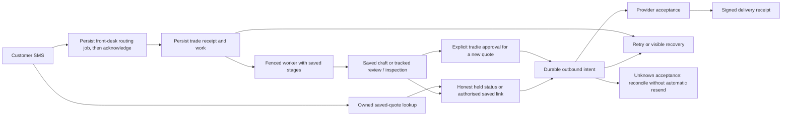

> Archived review history, captured 9 September 2026 before the final roofing-repair validation. Present-tense statements below belong to their recorded checkpoints. Consult [the current implementation report](2026-09-08-sms-receptionist-implementation.md) for the latest verdict. This archive preserves failed runs, earlier scores and superseded evidence.

# SMS receptionist implementation and review record

Source contract: [25-finding audit](2026-09-08-sms-receptionist-reliability-audit.md).

**Current review failure — roofing profile correction restarts intake:** the fresh actual-route matrix completed five normal cases and ten recovery cases each for electrical and plumbing (25/55). Roofing then failed its first burst scenario after six passing crash assertions; that parent exited 1, so none of its partial cases are credited as a completed batch. A first-name correction after a held roofing quote sends another intake-form link and replaces the stored review state with an empty `offer_form` state. The original saved quote survives, but the customer conversation incorrectly restarts. The failure is a runtime defect under repair, not an obsolete assertion. Painting and solar recovery remain unstarted. No fifth score has been awarded.

This is the implementation and review record for the audit. The original audit remains the historical baseline. Corrections are local source changes and staged service candidates; they are not deployed repairs. Full specification acceptance remains open until the controlled fleet, website and provider cases below are demonstrated.

The repairs persist inbound work before acknowledgment, recover interrupted turns, look up saved quotes for later link requests, and require explicit tradie approval before releasing a new quote. Failed or uncertain SMS attempts retain a recovery state. Quote links require a saved owned resource; dependency failures are distinguished from missing tokens. Later PDF renders preserve the bytes referenced by earlier messages, and commercial corrections invalidate stale prices atomically.

**Current platform checkpoint:** full04 passes TypeScript, **10,251 tests, zero failures and 24 explicitly skipped live cases**, and the **84-page production build**. There are 741 passing and nine skipped test files. All 16 commercial painting Chromium recovery cases and 29 correction cases pass. The parent exits 0 at 08:01:42 UTC on 9 September; 2,795 source inputs and 1,473 runtime inputs remain unchanged through every stage. All six refreshed service builds, five trade HTTP smokes and 16 compiled readiness checks now pass. The actual-route and primitive recovery matrices remain separate pending gates. These are local results, not evidence of deployed customer delivery.

Commercial correction repair is integrated: migration 221 and the paired web/approval callers atomically confirm corrections against the observed extraction and revision, retain operation receipts, invalidate stale price/proof together, and bind later pricing and rich approval to their actual source. The browser also rejects a price view paired with newer correction inputs. All 17 files matched the reviewed handoff at integration; one later test-only type annotation has a separately reviewed amendment with identical emitted JavaScript. The prior seven existing files and ten absent paths are preserved. Combined browser, platform, standalone approval and SQL compatibility checks now pass; the refreshed fleet checks are tracked separately.

Specialized roofing, painting and solar PDF storage is repaired locally. The baseline directly reproduced earlier objects being overwritten: **9 cases passed and 27 failed**. After the content-hash/byte-verification repair, all **115 relevant cases pass**, including the 36 new specialist cases, with zero skips, blocked external calls or runner errors. Scoped lint exits 0 and independent source review passes. The combined platform gate includes the repair; refreshed fleet gates remain below.

The final five-group standalone CI run passes **121/121 tests**: creation 18, residential form comparison 3, created-tool release 2, plan/invitation recovery 5 and owner/PDF/public release 93. It executes actual 221 Confirm → 219 Price → Save → generic and rich approval, retaining the independently expected A$2,481.95 commercial total and exact proof/generation. Independent review verifies all 334 named source/archive inputs, confirmed child exits and zero skips, runner errors or denied external calls. The preceding 115-pass/six-fail fixture run is preserved; its test-only cache correction retained the original bytes and all fourteen access assertions.

The F18 fallback correction passes 122 focused cases, lint and independent review. Web recipient review passes twenty focused tests and fourteen browser checks. The [balance-payment recovery checkpoint](2026-09-09-sms-balance-payment-recovery-evidence.md) passes 66 tests: 23 actual route/SQL/outbox compositions and 43 existing route cases. Retained operations preserve the saved recipient and return their actual delivery state without another send, including after contact changes and lost acknowledgements. These focused totals overlap future combined checks and must not be added to them.

The [joined final-chain checkpoint](2026-09-09-sms-final-chain-evidence.md) passes **75/75 tests within full04**: nine joined final-creation/credit/balance and signed-callback cases, 23 balance-recovery cases, and 43 existing handlers. Its 42 named inputs match the current source, including the PDF repair. Actual 217 is active. Electrical and plumbing each retain one final, one balance and three intended outbound messages; actual Twilio parsing and signature validation run against an offline HTTP fixture. The earlier 66- and 75-case checkpoints remain historical; their totals overlap this run.

Shared work covers historical GST, reviewed recipients, immutable generic PDFs and binding the rendered document to the reviewed quote. Its 232-case PDF/sender checkpoint includes 20 actual-handler A-to-B-to-A controls. The 54-case follow-up checkpoint includes 35 actual SQL/handler cases and 19 browser-operation helper cases; those nineteen are not rendered dashboard tests. All fourteen follow-up handoff files match. The final migration 218 extension passes **211/211 cases**, eight-file lint and independent review of 57 archived inputs. A later erased annotation changes one nonexecuted handoff-test input; the explicit delta review preserves the old archive and verifies identical emitted JavaScript. All runtime inputs remain unchanged. Readiness verifies 29 function contracts and requires 19 migrations, including 221. Both restricted function-owner authority and inaccessible correction-receipt RLS were reproduced and repaired without executing business writers in the probe. The 149-case pre-221 checkpoint remains historical. The combined platform gate passes; fresh fleet validation remains pending. **No fifth score has been earned yet.**

The preceding platform checkpoint passed **9,414 tests, zero failures and 24 skipped**, full typecheck and an 84-page production build. Its six candidates passed attestations, source verification, five HTTP smokes and thirteen compiled readiness cases. Those results predate current shared changes. Five normal compiled conversations and ten electrical recovery scenarios also passed under the corrected observer; the interrupted plumbing parent does not count. These are preserved checkpoints, not verification of the latest source.

## Rubric written before implementation

| Category | Points | Evidence required for full credit |
|---|---:|---|
| Requirement coverage | 30 | Every F01–F25 fix and acceptance check is mapped to implemented behaviour; no silent deferrals. |
| Recovery and concurrency | 25 | Durable receipt/jobs/outbox; fenced ownership; restart, burst, replay and ambiguous-result handling tested at real boundaries. |
| Quote and pricing correctness | 20 | Persist-before-link; tenant-authoritative prices; explicit review; canonical owned quote lookup; honest status and send outcome. |
| Regression and integration evidence | 15 | Focused failure injection, all service contract checks, typechecks/builds and appropriate platform regressions pass. |
| Release reproducibility | 10 | Versioned generated artefacts, dependency/schema contracts, clean builds and verified release/readiness evidence. |

Scores measure evidence, not effort. An unimplemented acceptance item prevents a clean review even with a high score. Unverified deployment/provider behaviour earns no production-validation credit. A material improvement means at least two points or closure of a previously failing acceptance item. Repeat review/fix while actionable implementation weaknesses remain; never stop solely because a score plateaued with failing requirements.

## Execution constraints

- Preserve unrelated dirty files and service customisations.
- Human approval remains required for customer quote release under the supplied project instructions. Missing rates never justify guessed prices.
- Do not claim a message delivered from provider acceptance alone.
- Record implementation and release validation separately; no skipped live checks are counted as passes.

## Implemented workflow

This describes the local implementation. A successful message submission records provider acceptance; only a verified delivery receipt establishes delivery. The controlled deployed acceptance scenarios remain separate below.

## Score trajectory

| Iteration | Coverage /30 | Recovery /25 | Quote correctness /20 | Tests /15 | Release /10 | Total | Verdict |
|---|---:|---:|---:|---:|---:|---:|---|
| First integrated build | 20 | 17 | 16 | 8 | 2 | **63/100** | FAIL: 21 regression failures; fleet and independent review incomplete |
| Second integration/review checkpoint | 23 | 21 | 17 | 10 | 3 | **74/100** | FAIL: second combined run has 12 failures; later fixes are passing focused checks, final source freeze pending |
| Third integration, 9 September | 27 | 23 | 19 | 13 | 4 | **86/100** | Scoped code review and full regressions pass; production build/final fleet verification pending |
| Fourth frozen checkpoint and acceptance review | 27 | 24 | 19 | 14 | 6 | **90/100** | Full suite/build, six candidates, five composed held journeys, 45 primitive recovery scenarios and two parity cases pass. Review still fails full acceptance; expanded composition exposes additional defects under repair. |

First-build evidence: 8,466 passing, 21 failing and 34 skipped cases in 8,521 discovered cases. New durable worker/Postgres checks pass 9/9; delivery agent reports 48 transport/media checks and 8 database outbox checks passing; trade agent reports 6 SQL contract checks passing; front desk reports 73 routing cases and 4 database cases passing. These focused counts overlap the full run and are not added to it.

Weakest parts and point costs at the first 63/100 checkpoint:

1. **Release evidence (8 points lost):** candidate builds, schema-before-code checks, actual deployment identity and controlled carrier delivery have not all been demonstrated.
2. **Requirement coverage (10 points lost):** review UI and all-tool release wiring still need integration verification; no clean independent audit pass exists.
3. **Recovery evidence (8 points lost):** the durable database tests establish primitives and worker recovery, but all real route-stage crash and burst cases are not yet exercised across built artefacts.
4. **Regression evidence (7 points lost):** the combined suite has 21 failures, including changed-contract test fixtures and several apparent resource/time-limit failures that require rerunning rather than assuming.
5. **Quote correctness (4 points lost):** canonical references, tenant pricing and approval gates are implemented but cross-channel release and saved-result replay require broader proof.

Subsequent revisions preserve those passing isolation/fencing/delivery checks and target the missing integration boundaries. Later scores below use the newer evidence; none is a production stability certification.

## Requirement coverage, updated 9 September 2026

Paths below are relative to `quotemate-automation/` unless named otherwise. “Local evidence” means the stated injected boundary was exercised; it does not establish a live customer journey. All rows retain the controlled fleet/website/provider acceptance gate at the end of this report.

| ID | Problem and underlying cause | Implemented correction | Local evidence / remaining proof |
|---|---|---|---|
| F01 | Roofing sent a generated token despite a resolved insert error. | `lib/sms/roofing-measure-dispatch.ts` checks the saved row, reuses its token and propagates persistence failure. | Dispatcher tests inject save/send failure; the preceding roofing candidate passed canonical-source, compiled-output and HTTP checks. Current candidate and composed journey refreshes remain required. |
| F02 | Solar's exported dialog ended with a promise instead of estimation. | `lib/sms/solar-receptionist.ts` gathers solar facts, persists a deterministic result and creates an owner review task; failures produce tracked handoff. | The preceding compiled solar journey gathered facts, saved one priced held result, notified its owner, answered a held-link request and suppressed duplicates after fresh processes. Current candidate refresh and front-desk-to-carrier deployment acceptance remain open. |
| F03 | Process-local background work disappeared after ACK. | Migration 198 receipt/job transaction, service workers and stage checkpoints; migration 210 extends this to uploaded plans. Intake recovery cannot complete without accepted SMS or a saved outbox. | Actual SQL/route replay tests pass. The fourth checkpoint passed 25 primitive kills plus 20 pauses using fixture business stages. Its five actual compiled-route journeys separately passed normal completion and restart/replay. Current candidates and the expanded actual-route kill matrix require refresh; deployed redeploy remains unverified. |
| F04 | A follower persisted during the leader's turn had no scheduled work. | Each provider receipt has durable work, per-customer FIFO ordering and its own sequence/turn identity. Saved-job corrections persist an owner task without rewriting the approved job; mixed requests also return saved status. | The fourth checkpoint's 20-pause primitive matrix handled correction, price and resend duplicates. Current actual inbound correction tests pass, including address/scope changes, mixed resend, numbered selection and replay. The expanded actual-route burst matrix adds a fourth, address-only correction and awaits refreshed candidates; scope semantics have separate actual POST coverage. |
| F05 | An expired worker could clear a new owner's lease or write late results. | Owner-token leases, heartbeat, hard attempt deadline, mutation fences and conditional release. | Actual SQL stale-owner rejection, hung-handler timeout and later-customer progress tests. |
| F06 | An intake foreign key incorrectly meant a quote existed. | Separate intake/estimate/saved/review stages; saved-quote replay repairs conversation linkback without repricing or demoting owner state. | Actual recovery routes test incomplete intake, lost quote response, approved/paid/cancelled state and missing conversation projection. |
| F07 | Each retry inserted another initial quote. | Unique initial estimate key and saved-result lookup; explicit revisions/final children remain separate operations. | SQL uniqueness and replay tests; production concurrent request replay is unverified. |
| F08 | Resend relied on transcript text and lost historical links. | Migration 201 seven-family tenant/customer lookup; `quote-actions.ts` resolves exact stored references and asks which job when ambiguous. | Eleven owner-release journeys cover seven families, same/new conversations, multiple jobs, manual follow-up and saved revised/final-child selection. Actual aircon/commercial and uploaded-plan creation journeys reopen and resend the same records. The new E/P chain composition joins actual final creation, owner release, inspection-credit settlement, balance creation, canonical pages, readback and saved-link resend. The initial paid inspection is seeded; live payment settlement and time-separated deployed conversations remain unverified. |
| F09 | Similarity repair trusted model or customer URLs. | Dispatcher permits only exact server-approved URLs; bare hosts, relative/encoded quote paths and invented destinations are removed. | URL regressions cover original defect plus bare and relative bypasses, cross-family tokens and added query parameters. |
| F10 | DB failure and missing token both became 404. | Seven public families distinguish dependency unavailable from absence; generic HTML/PDF also enforce release/owner preview. | Actual page/handler tests inject resolved DB errors, missing rows and held quotes. Applied production schema remains unverified. |
| F11 | Failed sends appeared as successful outbound history. | Migration 199 outbox/attempt lifecycle; `reply-publication.ts` makes outbox the sole publisher and excludes failed/unknown attempts from usable history. | Provider rejection, accepted-only polling/publication and durable SQL tests. |
| F12 | API acceptance was treated as final delivery without receipts. | Signed status callbacks, monotonic receipt transitions, stale-SID reconciliation and tenant recovery UI; unknown acceptance is quarantined. | The new joined tests use the actual saved callback URL, HMAC validator, status POST, SQL199, owner GET and transcript. Duplicate/out-of-order and legacy status fields, invalid bindings, explicit failed-delivery recovery, provider-read failures and accepted 201 responses without a readable SID pass. Carrier HTTP remains an offline fixture; live delivery/failure remains unverified. |
| F13 | Front desk awaited slow routing/forwarding before ACK. | Migration 200 durable inbox; a 3.5-second receipt deadline before ACK, followed by asynchronous recoverable forwarding. | Built front-desk checks cover failed/hung receipt DB and independent ACK. The compiled worker retries a timed-out forward on the next eligible tick without another receipt; migration tests separately cover same-receipt recovery. Controlled claim/timer fixtures do not establish deployed ACK timing. |
| F14 | Stale general dialog overrode explicit trade switches. | Explicit ownership corrections precede stickiness; completed/old gathers expire; bare answers retain the asking trade. | 73 deterministic router cases include all 25 trade pairs and mixed legacy state. |
| F15 | Roofing/painting fallback terminated useful follow-ups. | Trade-scoped clarify/status/resend/handoff; deterministic money and persisted owner tasks. | Scoped fallback, specialist and quote-action tests pass with model fixtures. The new scoped generation prompts still require the project's 100 anonymized hold-out intake-to-quote cases, five-dimension scoring and published baseline/candidate delta before shipping. |
| F16 | Exported roofing guessed default rates after tenant lookup failure. | Export canonical pricing-authority dependency closure; missing/incomplete/wrong-tenant rates fail closed to setup/review. | Pricing-authority negatives and generated closure verification pass. The preceding paired canonical/compiled roofing authority and pricer produced equal outputs for the same approved owned card and measurements. The paired run uses database fixtures; its current-candidate refresh remains required. |
| F17 | Form and SMS release policies disagreed. | Strategy v24, shared owner review gate, held public pages, atomic approved snapshot/send intent and historical-release preservation. | Same-brief parity passes through the actual painting form POST and SMS dispatcher: equal pricing, one held result, owned review task/notification and honest review-only customer status per lane. SQL/outbox/carrier and inbound orchestration are separate checks. |
| F18 | Completion/handoff promises preceded saved work or notification. | Replies describe persisted stage; required owner tasks and outbox intent are checked. New failures remain visible instead of completing silently. | Task failure, stale-task resolution, empty-intake send failure and saved-quote recovery tests. |
| F19 | Forwarder discarded MIME and fetched arbitrary URLs with credentials. | Original media types, allowed provider origins, byte/size validation, redirect controls and bounded reads. | PNG/WebP, arbitrary/private host, redirect, oversize and timeout cases use offline I/O. |
| F20 | Timestamp polling returned old messages or missed new ones. | Outbound is correlated by durable turn ID, accepted state and stable ordering; lookup error is not empty history. | Built front-desk checks cover failed baseline and accepted-only results. Compiled polling isolates tied-time replies by turn, orders by ID and waits through running/pending estimate stages. Fixture responses do not establish production timing or live overlapping conversations. |
| F21 | Nonempty environment values masqueraded as quote capability. | Separate liveness/config/readiness; exact schema/release fingerprints, tenant pricing and explicit recent synthetic evidence. Future synthetic timestamps are rejected. Published commercial/plan writers require actual guard-readiness RPCs; migration 218 adds read-only quote-chain compatibility checks. | The final 211-case SQL/contract gate and independent review pass, including all 29 function contracts, effective function-owner permissions and correction-receipt RLS authority. All 16 compiled boundary cases pass on the fresh six-service ready identity, including failed quote-chain readiness and two terminal-silence cases. Live synthetic evidence remains absent. |
| F22 | Public links could use a service API origin. | Validated website origin across quote/PDF builders and report images; cached PDFs regenerate once on origin change without repricing. | Origin rejection, four actual PDF URL exports, five report families and cache-transition tests. |
| F23 | Retired webhook silently acknowledged dropped messages. | Real signature validation plus atomic failed receipt isolated from ordinary workers; tenant recovery reference and explicit 503. | Signed/proxy/tampered request tests and real SQL failed-job isolation. Read-only inventory found all nine active tenant numbers on front desk. |
| F24 | Independent exports lacked a reproducible compatibility gate. | Candidate source/build/lock/migration hashes; compiler-produced output attestation; verifier rejects stale copies; local CI definitions build and HTTP-smoke generated services and test immutable images. Final/balance, commercial correction/price/save and follow-up write/event/history routes plus their imported helpers are mandatory website roots; the paired commercial editor is included. | The 19-migration contract passes 211 tests and independent review. Its website closure has 38 roots and 289 files with zero unresolved imports. All six fresh builds, compiler attestations and final current-source verifiers pass, along with five HTTP smokes and 16 compiled boundaries. Actual Docker/remote CI/promotion enforcement remain unverified. |
| F25 | Plan upload/result work and sends could disappear independently. | Durable upload receipt, immutable input identity, fenced extraction/pricing checkpoints, common outbox and legacy stranded-upload recovery. Migration 212 prevents mutation of already released plan prices/quantities. | Four actual invitation-helper/work/outbox/owner-recovery cases pass for success/replay, transient rejection, permanent definite rejection and failed enqueue, preserving the request/token/intent. Separately, actual multipart upload through worker, owner quantity review/repricing, approval, public page and resends passes on one newly created extraction. Storage/model/carrier are fixtures; these are separate compositions. |

### Extra integration closures found during review

- Generic first release requires the **displayed saved revision**, not merely a snapshot loaded by the server immediately before sending. The owner viewer and approval UI supply it; a missing/stale revision returns 409 with the review URL.
- `GET /api/tenant/sms-delivery?quoteId=<uuid>[&requestId=<uuid>]` reconciles a lost send response by stable identity. It returns the actual outbox status and ID; an owned quote with no intent is different from a missing quote or database failure. A deliberate resend uses one UUID retained across retries.
- Solar/roof token mutation and painting edit/release paths require their owning tradie and atomic snapshot checks. Editing a released roof creates a held successor; promoting a measurement alone does not release it.
- Generic release and carrier acceptance are separate stored facts. A newly approved quote is accessible while its SMS is pending; delayed delivery state cannot demote an already paid quote.
- Email remains the existing synchronous provider call without durable idempotency. A lost email response is unknown and must not be automatically replayed. This SMS audit does not certify email recovery or literal voice disconnections.

The final source review also checked ordinary model-written replies before a quote exists. The inbound route preserves the model's original reply identity and calls `enforceDialogGrounding` before dispatch; `assertGroundedReply` rejects amounts, rates, percentages and spelled-out prices before consulting any grounding context. Inspection offers are composed by server code. This was an existing safeguard, not a newly discovered missing guard. The current full run includes 24 passing dialog-grounding tests and 96 passing shared receptionist tests; live model-language evaluation remains separate.

That money guard does not validate a promise with no amount or URL. A separate F18 review reproduced an ordinary gathering turn saying “Sending the link now.” through the no-photo path: `stripLinkPromise` substituted its own “quote sorted and come back to you shortly” constant. The actual POST accepted that text while the `ask` decision stayed open without creating intake/quote work or an owner action. The fallback now says “I have not sent a link in this reply. What would you like help with next?” Only this deterministic copy and its explanatory comment changed in production. The before-fix run had one failing and 43 passing cases; 122 focused cases across four files then passed, including genuine resend interception and preservation of meaningful questions. Independent source review passed. The GitNexus impact result was `UNKNOWN`; direct inspection confirmed the shared inbound caller and generated-service exposure. The changed helper is included in the passing full04 platform checkpoint and the queued fleet refresh.

## Browser validation

`scripts/test-sms-recovery-ui.mjs` now renders five actual client components in Chromium with the application's CSS and offline auth/API/Next Link adapters. All **14 browser assertions pass** across 390px and 1280px widths. The original eight recovery/review checks remain; six generic send/approval checks cover reviewed-recipient conflicts and original-request retry after response loss. Twenty focused client/page cases separately cover owned contact lookup and a contact changing or disappearing after an uncertain response. Scoped lint and independent source review pass. The [web-recipient evidence](2026-09-09-sms-web-recipient-evidence.md) binds the corrected component bytes and preserves the earlier checkpoints. This is component integration evidence, not a real API/provider or Clerk-authenticated deployed end-to-end test.

Visual inspection found an undefined `bg-brand` token made the approval button hard to see. It now uses the existing accent/contrast tokens and the browser check verifies a painted background. Evidence: `sms-recovery-ui.json` and `sms-*-mobile.png` in the audit evidence directory.

## Pre-repair platform checkpoint: full04

The [full04 result](C:/Users/dalig/.codex/visualizations/2026/09/08/01a07f99-45aa-7301-bf72-b1e946ed3015/fifth-final-platform-04/platform-result.json) records successful parent exit and completion from 07:43:01 to 08:01:42 UTC on 9 September. Its SHA256 is `ba931d03485a617b66b0f98a723f28c98e6e46d4cdfa9768a54098715541e3e3`.

| Gate | Observed result | Boundary |
|---|---|---|
| Full `tsc --noEmit` | Exit 0; empty diagnostic log | Current combined application and tests |
| Full offline suite | 10,251 passed; zero failed; 24 skipped; 741 passing and nine skipped files | [Runner result](C:/Users/dalig/.codex/visualizations/2026/09/08/01a07f99-45aa-7301-bf72-b1e946ed3015/fifth-final-platform-04/tests/offline-result.json), confirmed child exit 0, no timeout/cancellation/errors or blocked external attempts |
| Commercial correction browser/SQL tests | 16 Chromium and 29 correction cases passed | Subsets of the full suite; real client components and local SQL/adapters, no deployed auth/provider claim |
| Final/credit/balance composition | 75 passed | Subset of the full suite; nine joined cases, 23 recovery cases and 43 existing handlers; separately archived current inputs |
| Production Next build | Exit 0; all 84 static pages generated | [Build log](C:/Users/dalig/.codex/visualizations/2026/09/08/01a07f99-45aa-7301-bf72-b1e946ed3015/fifth-final-platform-04/build.log); inert provider configuration, public-font access allowed |
| Exact five-group standalone CI orchestration | 121/121; all five children and parent exit 0 | Separate final05 execution; all 334 named inputs independently verified; no remote CI/image claim |
| Source stability | All 2,795 source and 1,473 runtime inputs unchanged after every full04 stage | Source SHA256 `0027176fd6f3bf2d03ea76b5ecb5d1e42c922f610fac45bf0b17c16dd6298e4f`; runtime `fdfd27b78c50b310c05919594d4fe203965852ecf4d29f0ed811d312543bb9c3` |

The 24 skipped cases are explicitly live DB/model/refinement checks. Focused results overlap and are not added to the full total. The earlier failed full runs and their concrete corrections below remain history; they do not replace this all-green rerun. Generated artifacts, environment files, dependencies and documentation are outside the platform source map; fleet manifests separately bind their release closures.

### Pre-repair fleet refresh

The six-service refresh in `final-platform-refresh-01` passes every build, compiler-produced attestation and final current-source verifier. All five trade HTTP smoke children exit successfully on their first attempt. Front desk passes 73 routing cases and its durable receipt, replay, deadline, MIME, correlation and polling checks. Both the build parent and later boundary parent exit 0, with no owned processes remaining.

The [current ready receipt](C:/Users/dalig/.codex/visualizations/2026/09/08/01a07f99-45aa-7301-bf72-b1e946ed3015/fleet-candidate-02/final-validation-2026-09-09/final-platform-refresh-01/after-refresh/final-ready.json), written at 08:19:53 UTC, has SHA256 `f3c2b52b3e9f29084ce74a197bbdd54c89f20350288a1caadbf85ca6172fdb2a`. All [16 compiled boundary cases](C:/Users/dalig/.codex/visualizations/2026/09/08/01a07f99-45aa-7301-bf72-b1e946ed3015/fleet-candidate-02/final-validation-2026-09-09/final-platform-refresh-01/frontdesk-readiness-boundaries.json) pass against that identity; result SHA256 is `3bb204b095a4606780f704450764212ade49a80693a01ffd4b0c5d43ce6cfb97`. The 14 final metadata records are separately archived under `after-refresh`; the earlier ready receipt is retained as `superseded-final-ready.json`.

The original five trade repositories retain their audit HEADs and all 27 previously recorded dirty-file hashes. Before/after refresh inventories match for all 1,156 tracked/nonignored source files, excluding environment files. This establishes preservation during this refresh and of the available audit baseline; no complete before-task tree inventory exists. The fresh 55 actual-route journeys, 45 primitive recovery cases, two parity cases and five front-desk/trade compositions still require their own completed results against this identity.

## Second build/review checkpoint

The second full platform run returned **8,825 passed, 12 failed, 24 skipped (8,861 cases)**. Its snapshot overlapped active implementation in this task and the mobile task sharing the checkout; it is not the final release test. Four plan recovery failures were traced to a real SQL-null checkpoint bug and subsequently passed in the 31-case plan suite after the repair. The other eight failures were in the concurrently maintained quote GET/pricing-version tests; their owning task received the exact evidence and is correcting/reviewing them. No skipped live test is counted as a pass.

Additional evidence collected during this review:

- 38 core cases passed for worker ownership/restart/deadline, saved-quote recovery, retired webhook and actual internal-route authorization.
- 14 actual intake/estimate/push cases passed, including new facts after an empty intake and a saved/released quote replay without repricing.
- 29 painting owner-edit/release, transcript publication and intake cases passed.
- 22 human-task/serial identity cases passed, including real PostgreSQL stale-writer rejection and a concurrent owner resolution.
- 31 plan upload/worker/pricing cases passed after migration renumbering, including crash/retry and reuse of legacy persisted extractions.
- 14 solar/roof editor and customer building-selection cases passed at the actual handlers and PostgreSQL boundary.
- Root integrated lint was reduced to zero errors; a remaining unused-variable warning was then removed. Later scoped lint and the resumed full TypeScript check passed.

These focused counts overlap each other and the full suite. They must not be added into a larger test total.

## Third build/review checkpoint, 9 September

The combined suite now passes **9,040 tests, zero failures, 24 skipped (9,064 total)**. The resumed full TypeScript check passes. Independent re-review ran 41 tests against the three crash-recovery fixes, URL authority and real retired-webhook signatures, with no further actionable issue found in that scope. The strategy reviewer also passed the final README/AGENTS/v24/assets consistency check. The production build and final fleet verification are still running at this checkpoint.

Review-driven rewrites addressed four concrete defects: replay after a committed conversation status could suppress the missing intake; empty-intake dispatch could swallow an unsaved message; saved-quote replay failed to repair conversation completion; and bare/relative generated URLs escaped the guard. Regression tests first exposed these failure paths and now pass. A further replay test caught repeated conversation creation when the original prior conversation was null; it now adopts the saved snapshot. Existing passing tenant, price, owner and outbox boundaries were preserved.

At **86/100**, the remaining deductions are: coverage 3 (complete per-tool controlled journeys missing), recovery 2 (full compiled process-kill/burst matrix missing), quote correctness 1 (no controlled tenant/model comparison), tests 2 (production build/final fleet checks pending), and release 6 (final hashes/builds plus image, CI and operational proof missing). Some of this is unfinished local test coverage, not an inherently external blocker. These are evidence gaps, not a claim that a newly discovered code fault remains in each category.

### Weaknesses and point costs at 74/100

| Weakness | Points lost | Work that improves it |
|---|---:|---|
| Final acceptance coverage |7|Finish independent code review, map every acceptance case, and run the same contracts through current built services and website.|
| Cross-stage and burst proof |4|Exercise actual composed handlers alongside the passing PostgreSQL primitives; retain all race/crash regressions.|
| Approval and saved-price consistency |3|Close legacy token mutation/release paths and generic approval/delivery separation; test historical links without assuming approval.|
| Final combined regressions and UI |5|Wait for shared backend sources to settle, rerun full suite/typecheck/build, then exercise recovery/review UI.|
| Reproducible release and operational proof |7|Refresh hashes, build all candidates, verify migration contracts, execute image/CI promotion gates and controlled provider acceptance.|

The strongest parts remain tenant pricing isolation, checked persistence, durable message intent and owner fences. They are retained while the weaker composed workflows are rewritten.

## Additional defects found by implementation review

These are implementation-review refinements of the original 25 findings, not a claim of a new exhaustive whole-product audit.

| Review problem | Underlying cause | Required/implemented correction |
|---|---|---|
| Duplicate transcript rows after accepted delivery | Specialist/photo/product/failure branches still inserted after the outbox published | All those branches use delivery-aware publication; accepted outbox is the sole writer. Failed unsaved sends cannot become ordinary conversation. |
| Empty intake could never recover | Completed intake work identity reused forever | Use persisted provider SID or platform message ID for each input revision, and reuse one intake row. |
| Same input entered two intake lanes | Direct structure and inbound handoff used different serial keys | Shared `smsIntakeWorkIdentity` gives both entry points the same receipt and serial identity. |
| Saved/released quote was repriced or demoted during replay | Estimate replay reentered the full estimator; intake replay reset status | Resume only missing review/delivery state, keep saved prices/tokens and preserve released terminal state. |
| Required handoff failure looked completed | Catch blocks logged enqueue/task failures without throwing | Required stage errors propagate to the durable job for retry/attention. |
| Indefinitely renewing hung worker | No hard attempt deadline; work and delivery shared one scheduler | Bounded attempt abort/fence, bounded DB fetch and independent outbox timer. |
| Delayed failures absent from tenant recovery | Jobs acquired tenant/conversation attribution too late | Attribute work immediately after an owned source resolves, including saved quote recovery. |
| Retired webhook was only a console warning | An HTTP 503 response gave no durable recovery identity | Validate signature, atomically retain a failed isolated receipt and show it to the owning tenant; never enqueue it to the normal worker. |
| Owner tasks survived stale attempts or reopened after resolution | Missing task-table fence and unconditional status update | Fence task writes; update only an open task and confirm the actual returned state. |
| Optional null stage crashed checkpointing | SQL `NULL` passed into `jsonb_set` nullified the whole checkpoint | Store JSON `null` explicitly with `coalesce`; regression checks replay skips the already-completed null stage. |
| Legacy painting release/edit bypassed owner review | Capability token alone authorized send/edit; failure rolled approval back | Require owning session, shared reviewed release, stable retry/resend identity and explicit reviewed changes with atomic paid/version guard. |
| Solar and roof token mutations raced approval | Long estimator operations saved by ID after an earlier approval check | Owned snapshot/release/payment CAS; preserve original released roof while creating a held successor. |
| Plan extraction still died after upload ACK | Upload route used process-local `after()` even though notifications were durable | Atomic upload/work receipt, immutable upload version, model/result checkpoints and recovery of stranded legacy uploads. |
| Generic accepted-outcome loss left a held customer page | Quote lifecycle represented both approval and delivery | Persist explicit owner release separately and atomically with the outbound intent; publish sent status from accepted delivery evidence. |
| Migration numbers collided with another task | Two tasks extended a shared migration directory independently | Coordinate allocations, preserve unrelated files and use feature-specific SMS migration 210 for plan work. |
| A send response could not be recovered by a differently cased UUID | Send used the route's UUID text while approval/recovery used PostgreSQL's lowercase form | Canonicalise quote and resend UUIDs in one key builder; real SQL and GET tests prove one initial intent and one explicit resend. |
| Bare-host validation damaged Australian email addresses | Matching could restart at a later domain label inside an email | Prevent partial-domain matches after a dot; keep full unverified URLs blocked while preserving ordinary AU/NZ email text. |
| Website helper changes did not invalidate service compatibility | Only top-level public pages and the service's own dependency closure were fingerprinted | Hash the complete local import closure of public pages, quote approval/send, delivery and PDF boundaries; reject unresolved imports and nested-helper drift. |
| Transitive service dependency changes retained a release identity | Trade fingerprints did not include their generated npm lock | Seal the actual lock before build/promotion, require its hash, and reject transitive-only lock tampering. |
| The fleet CI definition omitted website validation | Trade ingress checks could pass without compiling/testing the accompanying website | Require website tests, typecheck and an inert production build before the five-trade matrix and aggregate gate. Front desk retains its separate repository workflow. |
| A stalled outbox DB request could retain the recovery poller's in-flight guard | Outbox Supabase client had no application-level request deadline | Four-second DB deadline combined with caller cancellation; actual-client tests prove one timed-out fetch, later recovery and preserved unknown acceptance. The final patch passes focused and full-suite checks. |
| Old synthetic readiness evidence could validate a changed website | Website dependency hashes were verified separately but omitted from the trade release identity | Exporter, sealer and verifier now share a fingerprint including website dependencies. The compiled readiness probe rejects old evidence after a website-only approval change, with unchanged worker and lock inputs. |
| A new source fingerprint could accompany an older compiled service | The verifier checked source and dependency hashes but only the presence/behaviour of selected compiled files | The actual CLI reproduction accepted new source with stale output. A fingerprinted wrapper now runs the compiler and alias rewrite before recording the source identity and exact output inventory. Verification rejects absent/stale/tampered output records; trade readiness requires the matching build identity. Sixteen tooling tests across six suites, independent source review and the final fleet checks pass. |
| Direct handler execution could send customer links from the wrong configured origin | Inbound built `/upload/<token>` from `APP_URL`; a later compiled painting journey found its form opener using `ROOFING_APP_BASE_URL`, which also derives from `APP_URL` | Photo upload, product choice, signup/reminder and both specialist URL bases now use the canonical public-origin helpers. Actual handler regressions keep public and internal origins different. Generated bootstrap already normalises these variables; the reproduced accepted messages demonstrate direct-handler/website conflicting-origin behaviour, not deployed-service incidents. |
| An explicit “repainting interior walls” enquiry bypasses the painting specialist | The whole-word matcher omitted “repainting” | The bounded recogniser now accepts repainting/re-painting while preserving exclusion and existing-gather guards. Actual recogniser/engagement regressions pass; the final compiled journey retains the natural wording that exposed the defect. |
| Painting can send a form URL whose request was not saved | Its opener ignored resolved/thrown insert failures and its general catch swallowed required-stage errors | The opener uses a stable durable-work token, checked conflict-ignore persistence and owned readback before sending. Typed stage errors remain retryable. Tests cover failed save/readback, committed-response loss and replay of the same request. |
| A specialist turn can complete after losing its conversation state | State helpers logged failures; retrying a model/provider decision could change the reply and outbound identity | Every required roofing/painting state write now rejects errors and missing rows. Selected model and address-screen results are checkpointed; original conversation/history snapshots keep replay stable. Tests prove counter/state repair, a changing injected model response is not regenerated after checkpoint, and accepted replies are not duplicated. |
| Retrying the unmeasured-roof fallback can create another lead | It used a random token and unchecked insert before reply/state projection | Owned `roofing-unmeasured:<job id>` lookup precedes remeasurement. Existing migration-201 uniqueness, checked save/readback and a token checkpoint preserve one lead through committed insert/checkpoint response loss and post-send state failure. |
| A saved priced roof draft can be replaced by an unmeasured fallback | The caller interpreted `ok:false` after a failed status send as a measurement failure even when `savedToken` existed | A typed retry now preserves the existing priced resource. Actual caller and dispatcher tests prove one priced row, no extra unmeasured lead, no repricing and repaired review status. |
| Quoting readiness accepts an invalid nonempty rate card | The generated check tested object presence instead of required tenant prices | Readiness now reuses the canonical complete specialist-card validators and rejects owned-book read/ownership failures. Generic readiness checks its actual owned-book/GST contract plus separate recent synthetic evidence; it does not claim every catalogue job is quotable. The invalid-card HTTP-200 reproduction is retained; focused validation and source review pass. |
| The release gate omits a schema dependency of owner approval | Current website approval/send reads `job_quote_operations`, but migration 202 was absent from the required migration/hash/schema contract | The nine-migration checkpoint added the missing owner-operation contract. The later 211/212 guards extend it to eleven required migration hashes and actual trigger-readiness RPCs. Website/service readiness probes exact operation fields; empty valid tables pass, missing tables/columns fail. Front desk packages its fingerprinted schema record. Mobile-owned SQL remains unchanged. |
| The legacy deployment command bypasses the new candidate checks | It launched detached deployments from original service checkouts without the verifier | The legacy entry point now exits unsuccessfully before credential reads, subprocesses or provider calls and names the validated candidate procedure. Four offline command variants verify this refusal. No deployment was performed. |
| Held solar and painting PDFs remain publicly accessible from cache | Their public PDF routes lacked a persisted release/owner check before invoking cached helpers | Both actual GETs reproduced HTTP 200 for held anonymous requests. The routes now check release before cache access, allow authenticated owning previews and distinguish dependency errors from absence; 14 focused cases and independent review pass. |
| Painting HTML can show held prices after a release-state read fails | A second, unchecked read starts from `released=true` | Actual page rendering reproduced the price leak. Release fields now come from the initial checked row, with honest held copy. Actual page/PDF and publish-gate tests plus independent source review pass. |
| An aircon retry pairs an old saved token with newly computed prices/facts | The route recalculates before a helper returns only the prior row identity | A complete saved response receipt and validated input/plan-byte fingerprint now preserve the original response. Both actual POSTs replay without rates/model work; changed request content conflicts. Independent source review and creation regressions pass. |
| Commercial-paint save replay creates another quote after metadata loss | A best-effort extraction marker was the only idempotency anchor | Stable tenant/run/extraction/pricing-pass row IDs, conflict-ignore saves and owned readback retain one draft. UUID case is normalised. Exact source/customer provenance prevents guessed associations; legacy conflicts return409. Actual route failure/race tests and a real PostgreSQL boundary case pass. |
| Commercial-paint save loses the customer's contact while reporting success | Customer attachment was an unchecked write after saving the quote | The initial intake insert now carries the customer atomically; the actual creation regression passes. |
| A commercial tender PDF prints the internal engine URL | Save-quote builds its printed footer directly from `APP_URL` | Actual tender HTML reproduced the wrong origin. The footer now uses the canonical public URL helper; the creation regression passes. |
| Painting form messages promise an immediate quote before owner review | The deterministic opener and form acknowledgement retained pre-approval wording | Both now explain draft preparation and painter review before sending. Existing builder/state-machine tests (57) and independent review pass; actual compiled opener evidence triggered the correction. |
| Initial owner-approved SMS is absent from its proven originating conversation | Generic approve/manual-send and specialist release omit `conversationId` even when exact resource-linked review/intake/upload relations exist | A shared resolver checks resource, tenant, customer and tradie-number ownership before attaching the outbox intent. Portal-only resources and deliberate different-recipient manual sends stay unattached. Source, actual-route and 11 composed owner-release cases pass, including exact accepted transcript attribution. |
| A photo request can be sent twice after an inbound worker dies | Its randomly selected template is regenerated on replay and default outbox identity includes the changed body | Persist the selected message and use one explicit logical photo-request intent. Failed required dispatch stays retryable. The actual before-fix failure and 32 passing focused regressions are retained. The compiled matrix now requires exact intent counts; its expanded final rerun is pending. |
| Solar ignores a customer's explicit name correction after saving a result | Its saved-reference branch returned a held-status reply before general slot extraction | A dedicated saved-solar correction branch checkpoints extraction, updates only the first name, preserves the complete solar/reference state and sends one deterministic acknowledgement. Fifty focused cases pass, including failure/replay and fresh-intake/price-link controls. |
| Solar gathers a new panel preference while retaining an old supply phase or address confirmation | Phase/panel parsing ran only at the corresponding question step; postcode/state changes did not invalidate confirmation. Numeric supply text could also look like a street. | Parse explicit phase/panel facts before choosing the next question, reject conflicting/negated choices and reconfirm a changed address. Separate electrical ratings from address text. Fifty-six focused cases and independent review pass, including actual handler-to-estimator argument checks. |
| Solar silently ignores an explicitly requested system size | The existing `requestedSizeKw` field reached the estimator but was never populated from SMS | Capture bounded explicit kW requests using the existing form limit. Unresolved, invalid or conflicting sizes remain in a clarification state and cannot reach pricing; address digits and battery kWh are excluded. This is included in the same 56-case solar increment. |
| Post-intake address/scope corrections are ignored or detached from the saved job; a mixed resend returns too early | Saved specialist status and generic draft-suppression paths do not create a correction task, while quote actions return before processing another intent | The correction handler preserves saved inputs/prices, records the exact change in a per-receipt owner task and returns an honest unchanged-result acknowledgement. Mixed requests also get the saved quote's current status/link. Numbered selection resolves the original task, and a replacement address cannot redirect it to another job. Final source review, 118 combined inbound/recovery cases and two composed correction-to-owner-release cases pass; the actual compiled burst refresh remains pending. |
| A later correction task can make the original owner-release conversation appear ambiguous | The origin resolver treats every resource-linked task as creation evidence, including follow-up correction tasks from another conversation | Exclude the dedicated correction-task namespace before the bounded origin query limit, while preserving genuine creation-task and intake/upload ownership checks. Keep the later correction in its own conversation and the original release transcript in its proven origin. Twenty-five owner-origin cases and the final eleven owner-release journeys pass, including two actual correction-task-to-release compositions. |
| A valid commercial tender cannot be saved when optional height is absent | Strict equality compared JSONB's omitted undefined properties with the pricer's raw JavaScript object | Compare both price snapshots in the stored JSON representation after authoritative validation. The actual 422 reproduction is fixed, 17 tool-route cases pass and independent review passes. |
| Commercial repricing changes an already approved amount on the same public token | The public run reads the mutable latest priced extraction, while repricing leaves its release set | Migration 211 freezes published price-bearing sources and identity; the API refuses repricing with 409, checks readiness before writes and confirms persistence. The actual creation→approval→public-page case now retains the original 2481.95 amount despite changed tenant rates and makes no additional pricer call. The 32-case database suite and independent review pass. |
| Editing or repricing a released plan changes its reviewed quantities or price | Both estimator writers mutate the extraction read by the public plan page without a release boundary | Migration 212 and both API guards retain the published result; changed work requires a new plan. Actual PATCH and price POST reproductions exposed the mutation. Twenty actual-route/public-page, 46 pricing and 19 database cases pass, with safe rollback and independent review. |
| Plan-only changes can escape fleet compatibility checks | The mandatory website roots omit the plan upload producer and two estimator writers | Include all three roots and their transitive imports. Actual collector/verifier regressions reproduce missing-root and helper-only drift. The source correction, 76-case combined release/readiness regression and independent review pass before fleet regeneration. |
| A future readiness timestamp acts like indefinitely fresh evidence | The age check accepts any value below 24 hours, including a negative age | Require a finite, nonnegative age strictly below 24 hours. The actual generated readiness template reproduces the false green with 2099 evidence; malformed, null, stale and future cases now pass explicit regressions. |
| A generated image cannot copy its fingerprinted Docker metadata | `.dockerignore` excludes `Dockerfile` and `.dockerignore`, but the builder copies both | Retain both required inputs in the build context. Generated COPY-input checks now pass for all five trade exports. This matches [Docker's documented ignore behavior](https://docs.docker.com/build/concepts/context/#dockerignore-files); actual Docker execution remains unverified here. |
| CI never exercises the actual six container images | Existing workflows build and smoke host Node processes only | Add an explicit image build and bounded offline container contract gate to the trade pipeline and separate front-desk pipeline. Eighteen protocol/fixture tests, lint and independent source review pass. Actual image execution and promotion enforcement remain unverified. |
| Removing an invented link promise replaces it with an invented quote promise | The exhausted-strip fallback says a quote will follow shortly, even for an ordinary gathering action with no intake or owner task | The actual POST reproduction captured that accepted reply. Replace only the deterministic fallback with an honest current-reply clarification. The 122-case focused run, lint and independent review pass; the changed shared helper awaits final platform/fleet validation. |
| Required tool and owner compositions do not run in the default CI test suite | Dedicated `.mjs` suites are excluded by the default TypeScript test pattern, and owner tests depended on a previously generated parity report | Use a committed synthetic seed and five required standalone CI groups with fresh-report, exit and network checks. The exact five-group command passes 121 cases, including all three remaining residential form comparisons. The older four-group 118-case checkpoint is retained. |
| Historical generic reports can recompute tax from current settings or serve an old PDF after price validation fails | The report reader omits saved tax/version evidence and defaults missing trade/tax; the download route can fall back to a cached path after validation failure | The shared saved-tax, owned-report, strict PDF/HTML and immutable-render repair passes the independently reviewed 232-case checkpoint. The exact five-group CI refresh passes 121 cases with the current immutable cache shape. Earlier SMS results are preserved in the [BE01 checkpoint](2026-09-09-sms-be01-fixture-checkpoint.md). |
| Customer SMS can label a saved non-GST quote as including 10% GST and round away cents | Generic/final send templates use a fixed tax label and whole-dollar formatting independently of saved quote authority | Saved tax and cents now drive the shared generic/final copy. The joined E/P chain exercises non-GST and GST prices, inspection credit and fee-inclusive balance amounts through actual message parsing with offline provider HTTP. Final generated fleet identities still require refresh. |
| An approval can miss a concurrent document or saved-tax-version change | The generic release revision and SQL comparison omit `pricing_book_version_id`, `report_doc`, `report_style` and parent identity; these can change while PDF work is awaited | Migration 215 compares the complete 20-field reviewed snapshot under the existing owner/paid lock. The shared 155-case checkpoint covers migration, sender and owned readers. The SMS 75-case chain separately passes against actual 215, including reconstructed older-receipt readback. Current readiness passes 211; the combined full04 platform gate also passes. |
| A changed contact can receive a quote after the owner reviewed another destination | The release revision covers quote fields, while recipient details are resolved from mutable contact records after review | The mobile C08 task owns server recipient checks and saved-tax message calculations; the SMS team owns web adoption. Twenty focused web cases, fourteen browser assertions, scoped lint and independent source review pass. Combined server/outbox verification is pending. Optional protection does not cover callers that omit it. |
| A lost-response retry is disabled after the current contact disappears | Both web send controls test only the current contact prop despite retaining the original operation's reviewed recipient | Both controls now use the retained operation's reviewed recipient for retry eligibility while fresh missing-contact sends stay blocked. A-to-null and A-to-B cases preserve the identical request body. The final web checks and independent review pass; successful backend replay remains a separate contract. |
| Final-quote creation separates source/payment checks from child insertion | The route probes paid children and reads the source/intake/pricing before a later insert; its partial unique index protects unpaid children only | Migration 214 atomically validates the owned source and creates/reopens the lifetime final child. Both creation routes are mandatory fleet roots. The new E/P composition executes actual 214 through owner release, credit settlement and balance creation; current compiled compatibility still needs refresh. |
| Final-payment requests can claim a send before dispatch and accept insufficient quote-chain/amount proof | The route uses `sent_at` as a short claim and has permissive money/deposit, ancestry and recovered-balance checks | Strict owned chain/money validation and atomic 213 preparation use stable delivery identity and the shared release/outbox. The 75-case checkpoint includes the original 66 plus actual final creation and 217 settlement joined to balance creation/recovery. Only the paid inspection root is seeded in the new chain cases; actual Stripe settlement and the final fleet refresh remain unverified. |
| An accepted payment-link operation cannot replay after the current contact changes | POST validates fresh contact before loading the exact saved intent, so the same retained UUID returns 409 while its GET correctly reports accepted | The narrow SMS repair validates the saved tenant/child/key/payload, sender, recipient and conversation after existing money/revision checks. It returns read-only saved state before fresh-contact resolution and refuses a changed expected recipient. New UUIDs still check current contact. The 23 actual compositions plus 43 existing handlers pass; independent runtime and test/evidence reviews pass. No replay prepares, approves or dispatches again. |
| A stale small final quote can mark a newer larger final paid by inspection credit | The post-dispatch credit stamp checks ID/unpaid state without locking and comparing the accepted quote revision and paid initial-root proof | Migration 217 and the shared settlement helper validate the accepted complete snapshot and owned paid inspection under locks. Synchronous sending and later outbox acceptance use the same accounting contract; failure preserves carrier evidence and returns pending/review state. The independently reviewed 72-case shared checkpoint and 75-case SMS joined checkpoint pass. The current 211-case readiness check verifies the installed settlement contract; the combined platform gate passes and fleet refresh remains pending. |
| A queued message's PDF can change after another render | The stored object path is reused with overwrite enabled, while the durable outbound retains only that path | Generic PDFs now use content-hash paths and exclusive uploads; an uncertain upload is reused only after exact-byte verification. Mobile's final 232-case PDF/pricing/sender checkpoint and independent source review pass. The owner fixture seeds the same immutable cache shape and passes within the exact 121-case standalone CI execution. |
| A PDF can describe an unapproved intermediate quote even if the final database comparison passes | PDF rendering rereads mutable fields between owner review and atomic release; an A-to-B render followed by B-to-A restoration can satisfy the later A snapshot check | Both generic senders pass the reviewed release revision into PDF preparation, which compares its complete 20-field quote source with that revision. Independent actual-handler A-to-B-to-A tests pass (20 cases within the 232-case checkpoint), with scoped lint. This remains local artifact-authority evidence, not a live delivery claim. |
| Commercial painting can silently retain a stale labour rate or fall back to an unproven GST book | The effective inherited rate is reused as though it were an explicit owner override; the tax source can be selected by fallback | Migration 219 records the exact owned source, labour intent, GST and BOM, then compares them in the atomic save. The reviewed identity is the proof plus its microsecond-preserving pricing timestamp. Lost-response recovery preserves the original draft even after an identical reprice; clearing an earlier phone is a customer conflict. The shared server handoff passes independent 108-case review, a 140-case broad gate and 53 final scope/proof cases; these overlap. Root verified all eight frozen server/migration hashes. Actual 221 Confirm/219 Price compositions pass within exact CI121, current readiness passes 211, and the combined full04 platform gate passes. |
| Manual follow-up SMS can lack tenant/retry identity or use inconsistent target/history records | The follow-up endpoint omits tenant and durable operation context, accepts conflicting quote/conversation references, and hydrates some contacts without tenant scope | Migration 220 and paired handlers/callers retain an explicit operation identity, owned target and exact outbox payload. Acceptance requires actual provider evidence; a SID alone on an unknown/failed record is insufficient. Readback and history repair preserve uncertainty without resending. The independently reviewed 54-case shared checkpoint passes, including browser receipt logic through explicit storage/transport/lock adapters; fourteen frozen source files match the handoff. Rendered follow-up dashboard behavior remains a separate boundary. |
| A manual follow-up event can be reported successful after only one write commits | Event insertion and the quote projection update are separate, with an unchecked later write | The 220 note operation commits the event and quote projection atomically. Lost acknowledgements retain the same operation identity. Accepted SMS history repair has its own recoverable state so a logging failure does not erase provider evidence. These boundaries pass within the same 54-case checkpoint and the combined full04 platform gate. |
| Delayed follow-up history repair can overwrite newer conversation state | Repairing an older accepted send reapplies its pin and reopens/clears the current receptionist state without considering later activity | Repair preserves newer inbound activity, newer or equal-time pins and closed state while appending the original accepted evidence at its actual acceptance timestamp. The final independent SQL/handler review covers these ordering cases, uppercase operation IDs, contradictory provider evidence and history-read failures. |
| Readiness can pass while a function owner cannot perform the promised operation | Function-body and service execution checks omit the effective owner's table, schema, helper and RLS authority | The first extended readiness run reproduced this false green by assigning balance preparation to a restricted owner. The catalog-only probe now verifies effective owner authority without invoking a writer or requiring a superuser. Compatible non-superuser and inherited-permission controls pass. The pre-221 correction passed 149 cases, lint and independent review; the failed 145-pass/one-fail run is preserved. The current 221-aware gate passes 211. |
| Readiness can pass while correction receipts are inaccessible | The 221 readiness extension checks receipt grants but initially omits effective row-level-security authority for the invoker | The baseline's sole failure (130/131 passed) reproduces a service role that owns the credit ledger but cannot bypass correction-receipt RLS while readiness reports true. The catalog-only check now verifies authority over the receipt relation itself, accepts entitled ownership and rejects FORCE RLS. All 211 focused cases, scoped lint and independent review pass; the failed reproduction remains preserved. |
| Follow-up message history can change without invalidating the fleet's website compatibility identity | The required-root list includes follow-up writers and events but omits the message-history GET route | Add the actual message-history route to the required website closure, including omission and tamper assertions. It adds one file and no unresolved dependencies. The affected health/schema/closure/identity gate passes 48 cases, lint and independent review; all six final candidates must be regenerated from this contract. |
| Commercial corrections can partially commit, overwrite another correction or clear a newer price | The ordinary web PATCH writes run metadata before validating extraction input, updates the extraction without an expected-baseline/latest-extraction comparison, then makes a separate unchecked status write | Migration 221 and the paired observed-revision caller are integrated: atomic correction/metadata/status changes, complete price/proof invalidation, retained operation recovery, source-bound Price and rich approval, and protection against mixing two GET generations. Backend 80 and lint pass; full04 includes all 16 Chromium and 29 correction cases, while SQL compatibility211 and exact composed approval CI121 also pass. The legacy PATCH adapter remains compatible but cannot establish an old client's displayed baseline or retained retry identity; the current web caller uses the explicit correction operation. |
| A new specialized PDF render can replace a document referenced by an earlier message | Roofing, painting and solar use deterministic storage paths with overwrite enabled; cache invalidation can trigger another render at the same path | The baseline reproduced changed bytes in earlier objects for all three trades (9 controls passed, 27 cases failed). The patch reuses immutable upload/readback logic, adds a PDF hash inside the existing token/template/origin scope and refreshes legacy cache keys once. All 115 relevant tests pass, including 36 specialist cases; scoped lint and independent source review pass. Combined platform validation passes; refreshed fleet validation remains pending. |

### Validation corrections, separate from application defects

The first exact five-group run after 221 (`standalone-ci-five-group-final-04`) passed 115 cases and failed six. Its first four groups passed all 28 cases, and the owner journey file passed all eleven, including the actual confirmed commercial source. The six failures came from a separate PDF-gate fixture's old flat painting/solar cache paths. The repaired helpers correctly refused those paths as current immutable caches and reached the deliberately unavailable renderer, returning 503. The fixture now retains its original bytes under the correct token/revision/origin/content-hash path and checks the exact requested key. Independent review verifies that all fourteen test bodies/assertions remain byte-identical. The complete `final-05` rerun passes 121/121, with four-file lint, confirmed child exits and no denied calls. This is a fixture correction, not a new application regression; the failed result is preserved.

The combined `fifth-final-platform-03` stopped at typechecking, before tests or build. Its sole TS2345 was the correction-test helper inferring a UUID-only owner type while the negative 401 case deliberately passes an empty string. Adding `owner: string` changes no emitted JavaScript; the before/after output hashes both equal `b7c8b2cd1311e366b5ff1e501742264263fe347be19e78f5a0940e124bfd9266`. Scoped lint and independent delta review pass. All 334 standalone CI inputs remain unchanged. The fresh `fifth-final-platform-04` typecheck, full tests and build all exit 0 with unchanged source. Its runtime hash remains `fdfd27b78c50b310c05919594d4fe203965852ecf4d29f0ed811d312543bb9c3`.

The final frozen full-suite execution completed at 05:48:43 UTC with **10,137 passed, one failed and 24 skipped tests (10,162 total)**, across 738 passing, one failing and nine skipped files. Its only failed assertion expected eleven required migrations while the actual health endpoint correctly returned eighteen. No unhandled errors or blocked external calls were recorded, and all 2,785 source hashes matched before and after execution. The nonzero test exit and wrapper failure verdict are retained in [the full result](C:/Users/dalig/.codex/visualizations/2026/09/08/01a07f99-45aa-7301-bf72-b1e946ed3015/fifth-final-platform-01/tests/offline-result.json).

Independent review approved a bounded correction: keep an explicit eighteen-migration expectation, add the omitted message-history compatibility root, and test its inclusion, omission and tampering. Exactly three files changed; the 1,465-file application runtime inventory and hash remained unchanged. All **48 affected health/schema/closure/identity cases pass**, with zero skipped cases, denials or unexpected errors, plus lint and independent source/result review. This is full-suite evidence followed by targeted correction validation, **not an all-green full-suite rerun**. Full typecheck and the 84-page production build then passed at 06:03:36 UTC; all 2,785 source hashes stayed fixed at `f36682c8500bcad31f02eac5419fe19ae4d8a2e80be42d25534e3f55f2c37534`, with runtime hash `b57cd5d7e7980599bc20e48780a35aa7c70e2f12d93c3b24f712c8378c358227`. The [build acceptance record](C:/Users/dalig/.codex/visualizations/2026/09/08/01a07f99-45aa-7301-bf72-b1e946ed3015/fifth-final-platform-build-02/platform-result.json) preserves that successful pre-221 checkpoint. The subsequent runtime correction is included in the successful full04 combined gate above.

The first fifth-cycle full-suite attempt was stopped and is retained as `fifth-full-tests.log.attempt-01`. Its validation script incorrectly assigned nonempty dummy values to optional credential names. Eight missing-key assertions consequently entered configured-provider branches; the invoice fixture could reach its Gemini URL with an inert key and dummy `xxx` input. No real credential or customer data was supplied, and no successful model generation is established. That attempt was not transport-fenced and is not described as network-free. A separate failure was the lock-tamper fixture's stale nine-migration list; it now uses the shared eleven-migration contract without weakening its tamper assertion.

The corrected script leaves optional keys empty and adds a validation-only loopback fetch/TCP backstop for Vitest and its Node children. All 155 tests in the seven affected provider areas pass with no recorded real-network attempt. Independent review and a direct transport probe verify external fetch/socket rejection and working loopback fixtures. This is a Node test boundary, not an operating-system sandbox; subsequent TypeScript/Next build runs use inert provider configuration and do not inherit that test-only network claim.

The next complete fifth-cycle run discovered 9,298 cases: **9,273 passed, one failed and 24 skipped**. Typecheck and build did not run after that failure. The failing origin test assumed `PUBLIC_WEB_ORIGIN` was unset while the validation runner deliberately configured it. The runtime returned the safe configured website as intended. The test now explicitly isolates its fallback case and separately checks configured-origin precedence; all 29 link/origin/action regressions pass. This is a test-environment correction, not a repaired customer URL leak. A fresh full run is required after the subsequent address/scope correction work.

That completed run's transport log also records nine **blocked** Stripe socket attempts from the database-only payouts fixture, whose optional enrichment was enabled by the inert test key. The Node backstop rejected each attempt before connection. The fixture now explicitly clears that key for its database-only cases; all six cases pass with no attempted external call. No payout route behavior changed. The original attempt log is preserved, and the next shared local/CI test runner will fail on denied I/O even if application fallback catches the transport error.

The shared `scripts/test-sms-audit-offline.mjs` runner is now used by the authored website CI gate. It sanitises the child environment, requires fresh test artifacts and a successful Vitest report, enforces a deadline, and fails on any recorded external-call attempt. Its actual CLI passes 31 cases (16 runner cases, nine link cases and six payouts cases) with an empty outer denial log; lint and independent review pass. Cancellation tests exercise the registered signal handlers, not Windows operating-system signal delivery. Public-font downloads during the separate inert production build are outside this test-only network claim.

A broad `eslint .` attempt also traversed generated Cesium assets and reached a 3.9 GB working set. It was stopped, recorded as exit -1 and is not a lint pass. Audit-owned changed-file lint results are recorded separately. Neither validation-runner issue caused an application code change.

The 9,414-pass full run was followed by three TypeScript errors in two test files: one untyped PostgreSQL result and two JavaScript callback result properties inferred as `never`. Only erased annotations changed. `test-type-repair-emission.json` records before/after hashes and byte-identical emitted JavaScript for both files. All 48 affected cases then passed with zero outer network denials; scoped lint and full `tsc --noEmit` exited 0. The original failed typecheck and stopped build stage remain recorded in `fifth-integrated-03-platform.json` rather than being overwritten. The replacement production build has its own log/result.

Release review found that the ordinary CI test inventory omitted the standalone owner/tool/plan suites. Two owner tests also depended on a generated parity report outside their fixtures. They now load an explicit synthetic fixture containing the identical saved quote/estimate and source provenance, with no fabricated test-success fields. The preceding CI definition ran four fixed configurations through the shared offline runner, requiring fresh completed composition reports and preserving diagnostics on failure. Fourteen negative orchestration controls and independent source review passed. That historical exact execution passed 118 cases: 18 creation, two created-tool release, five plan/invitation and 93 owner/PDF/page/origin/immutable-plan cases. The current five-group definition adds all three remaining residential form/SMS comparisons and passes **121/121**, with zero failures, skips or recorded outer external-call attempts and confirmed child/parent exit. The final05 independent review verifies all 334 archived/current source hashes; the earlier 329-input execution remains historical. This executes the exact Node orchestration locally; it does not establish remote GitHub Actions or Docker execution.

That first replacement build passed compilation and its intrinsic TypeScript check, then failed while prerendering `/admin/files` with Windows `UNKNOWN` from `mkdir .next/server/app/admin`. The directory existed afterward, its ACL granted the user full control, no competing Next process was found and the drive had about 107 GB free. These observations do not prove the cause. The failed log/result and complete generated output were preserved as `fifth-next-prerender-failed-01`. The unchanged application then passed a build from an initially absent `.next` directory: compilation, intrinsic TypeScript, all 84 static pages and final output, exit 0 at 01:15:55 UTC. The cause of the earlier filesystem error remains unproven; it was not repaired by an application code change.

The first current electrical recovery run passed six real process-kill cases, then failed its first burst assertion because the observer expected tenant attribution at initial receipt claim. The actual route deliberately persists the signed raw receipt before tenant lookup. Independent review confirmed that the corrected observer must require a null tenant at that initial claim, bind the exact envelope, work key, serial key and owner, and then require the resolved tenant at the selected checkpoint, completion and correction task. All saved-price and side-effect assertions remain. This is a harness correction, not a runtime repair; its failed run is preserved and the complete five-normal/fifty-recovery matrix must pass under the corrected harness identity.

## Compiled process recovery evidence

`docs/audits/2026-09-09-sms-process-recovery-results.json` records real child process IDs, compiled library hashes, checkpoint counts and final database facts. At the fourth checkpoint the matrix passed **25 kill/restart scenarios and 20 paused burst scenarios across five attested trade artefacts**, with exit 0. Across those 45 scenarios, 1,080 repeated follow-up submissions resolved to 135 distinct follow-up jobs/intents. This is historical evidence until the refreshed candidates complete the same matrix; the older 25-kill/15-pause run is also retained.

The parent process keeps PGlite and actual migrations 198/199 alive while each compiled worker is killed after receipt, intake persistence, quote persistence, outbox creation or observed fixture-carrier acceptance. Restart preserves one initial quote and intended outbound; unknown acceptance is not automatically resent. The matrix pauses before history, after saved history, during drafting and before completion. At every pause it submits eight copies each of a correction, price question and resend. All three intended messages remain queued, resist a competing same-serial claim and run once in order after the predecessor releases ownership.

This is **compiled worker/outbox integration with fixture business stages**, not execution of every complete trade route. Paused draft followers deliberately receive the draft job's serial key; that is not proof of production route key assignment. PGlite serialises its local SQL and lease expiry is advanced deliberately. Existing actual-route regressions and the new compiled-route harness provide separate evidence. Production multi-connection contention, live model behaviour, full cross-channel journeys and actual carrier delivery remain distinct checks.

## Actual compiled conversations and cross-channel comparison

The fourth-checkpoint [five-trade compiled-route matrix](2026-09-09-sms-compiled-route-journeys.md) passed against its attested candidates. It used 67 child processes, completed 23 jobs from 19 unique inbound SIDs and replayed all 19 without extra work. Each trade saved one priced held result and one notified review task. The 28 fake-carrier calls matched persisted accepted intents, including 23 customer messages with one attributed transcript each. A new held-link request per trade returned saved review status without releasing a price/link or repricing. Current-source execution of five normal journeys and fifty actual-route recovery/burst scenarios remains queued; earlier counts do not validate the new corrections.

These children execute the actual compiled inbound/intake/estimate handlers and trade pricing, with real selected migrations over a limited PGlite schema. Model, measurement and carrier responses are fixtures; a test adapter supplies the PostgREST boundary. Main bootstrap/HTTP, optional RAG/media reports, production RLS and owner-approved release are not part of these five composed journeys. Separate HTTP, public-page, owner-action and delivery tests cover their stated boundaries.

The fourth-checkpoint [two-case parity run](2026-09-09-sms-cross-channel-parity-evidence.md) passed with exit 0 and a completed result with no failed tests; it also awaits refreshed candidates. F16 compares actual canonical and compiled roofing authority/pricing on the same owned approved card and measurements. F17 sends the same painting brief through the actual form POST and SMS dispatcher, comparing pricing, persisted review stage, owner notification and honest customer status. Its database and delivery fixtures do not establish a complete frontend-to-carrier journey.

## Read-only number inventory

The provider inventory on 8 September 2026 contained 12 SMS-capable numbers. All 9 numbers associated with active QuoteMax tenants had the configured front-desk primary webhook. No number referenced the retired QuoteMax platform SMS URL. No Messaging Services or number-level application overrides were returned for this account.

Three numbers had no tenant assignment: one had no SMS URL, one an ngrok URL and one a Vapi SMS URL. They are configuration verification items, not proven failures on active tenant numbers. Primary/fallback methods, masked number fingerprints and tenant associations are recorded in the [redacted inventory](C:/Users/dalig/.codex/visualizations/2026/09/08/01a07f99-45aa-7301-bf72-b1e946ed3015/live-sms-webhook-inventory.json). No webhook or database setting was changed.

## Release prerequisites still open

### Tool and surface acceptance

Five routed SMS trades do not exhaust QuoteMax's enabled tools. These rows keep the additional tool journeys visible without adding new router trade identities.

| Surface | Implemented/local boundary evidence | Composed acceptance still required |
|---|---|---|
| Electrical, plumbing, roofing, painting and solar SMS | Five attested builds and passing [actual compiled-route journeys](2026-09-09-sms-compiled-route-journeys.md), each saving a priced held draft/review task, answering a later held-link request and suppressing replay; HTTP ingress and front desk tested separately | Same controlled journey through front desk, selected trade, owner review, website and delivery receipts |
| Residential quote-request forms | Three new actual form/SMS business-boundary comparisons pass for electrical, plumbing and roofing: equal saved inputs/prices/authority, one held draft and notified owner task per lane, exact accepted messages and unchanged replay. Painting has its separate same-brief form/dispatcher comparison. | These comparisons start at canonical SMS business boundaries, with model/measurement fixtures. Full inbound/browser and controlled website/owner/delivery journeys remain separate. The registry exposes these four trades; solar is not a residential-form option. |
| Plan take-off/upload | Four actual invitation/recovery cases preserve the request/token and intended send through definite failures. A separate multipart-upload journey runs migration 210 work, extraction/pricing, owner quantity review/repricing, approval, public page and resends on one newly created extraction. Held PDF/page gates and failure/retry checks are separate | The invitation and upload are separate local cases, not a complete inbound/bootstrap-to-upload composition. Controlled provider/storage/carrier evidence is absent; extraction/model output and PDF bytes are explicit fixtures |
| Air-conditioning recommendation | Current-source actual recommendation creation, owner approval, public rendering, saved-job API and new-conversation resend run on the same PostgreSQL rows; replay retains the original result without pricing or location work | Selected deployed website and controlled carrier; this is an owner tool, not an added router trade |
| Commercial painting | The final 121-case run composes actual 221 GET/Confirm → 219 Price → Save, generic owner send, separate rich approval, public pages, saved-job API and resend on the same rows. It checks a fixed A$2,481.95 result and exact proof/timestamp. Published repricing returns 409; late confirmation replay preserves the released result | Fresh fleet checks, then controlled deployment/carrier; the combined platform gate passes. The older ready/raw/null-corrected seed is historical. Residential painting SMS remains separate evidence |
| Tradie review, final and balance quotes | Eleven owner-release cases cover seven families and saved-resource selection. The new E/P composition joins actual final creation, owner send, inspection-credit settlement, balance creation, canonical pages, saved resend and signed receipt SQL. Two actual correction tasks separately preserve original conversation attribution | Controlled deployed final/payment/receipt journey. Only the initial paid inspection is seeded in the new chain; no live charge or native action is executed |

### Specification acceptance ledger

This ledger tracks the audit's final acceptance gate separately from the individual fixes. A passing test of one boundary does not imply that the complete scenario passed through the front desk, service, website and carrier.

The specification accepts an authorised saved quote link or an honest tracked review, inspection or unavailable outcome with a responsible party and recovery state. Unsupported work and missing tenant prices must never be turned into a fabricated finite quote.

| Required scenario | Local evidence | Remaining acceptance |
|---|---|---|
| Intake to authorised quote or tracked review/inspection, for every enabled tool | Actual platform handlers, seven-family lookup, staged ingress and five passing compiled trade journeys to a priced held result with a notified review task | One composed controlled journey per routed trade and additional enabled tool through front desk, selected fleet, owner actions and website |
| Immediate/later link request, new conversation, multiple jobs and revised/final quote | Eleven actual owner-release cases cover same/new conversation, multiple jobs, saved child selection, manual send and initial attribution. Created-tool cases reopen/resend the same rows; new E/P chains actually create final/balance children and recover their exact operations | Actual time-separated controlled conversations and live payment settlement. Fixture timestamps differ by one day; this does not simulate a deployed day of activity |
| Burst corrections, scope/address changes, MMS, missed model turn and trade switch | Passing 20-pause FIFO matrix, address regressions, signed photo-only ingress, media validation and 73 router cases | Actual business-route bursts with model/fallback semantics; controlled missed-model-turn, MMS, switch and correction journeys |
| Crash, duplicate receipt, lost commit response and unknown send acceptance | Actual SQL/route replay regressions, 25 compiled primitive kills and five compiled conversation/replay journeys on the preceding attested candidates; refreshed runs are queued | Actual business-route kills at every stage; production redeploy and multi-connection behaviour |
| Missing rates/setup, held approval, failed owner notification and opt-out | Fail-closed pricing/readiness, held public pages, owner task failure, outbox recovery and browser retry suppression | Controlled tenant setup and provider rejection/opt-out cases |
| Seven public token families: missing token versus dependency outage | Actual generic, roof, paint, solar, plan, aircon and commercial-paint page/handler checks; PDF/release guards | Matching applied schema and rendering on the chosen deployed website |
| Tenant/customer isolation in lookup, resend, media and pricing | SQL/handler ownership tests, no-default-price tests and media host/redirect restrictions | Controlled cross-tenant requests against the release candidates and deployed database policies |
| Delivery failure and out-of-order callbacks recoverable by tradie | Joined saved callback URL → actual signed status POST → SQL199 → owner GET/transcript, including explicit non-delivery recovery, stale-attempt refusal, missing-SID and provider-read failures; actual recovery UI components tested separately | Controlled carrier receipt/failure and recovery with the designated recipient |
| No new price or quote bypasses explicit tradie review | Seven-family actual owner release/public rendering, held HTML/PDF, consent UI and created aircon/commercial journeys; published commercial/plan mutation failures reproduced and repaired with database guards | Fresh fleet validation and the same policy on the selected deployment and controlled carrier; current platform and guard checks pass |

The preceding platform checkpoint passed **9,414 tests, zero failures and 24 skipped (9,438 total)** across 716 passing and nine skipped test files. The shared runner reports successful child exit, no timeout, no cancellation and no blocked external-call attempts. It ran from 00:34:35 to 00:45:15 UTC on 9 September. The source snapshot captured during initial collection and the post-run snapshot match: 2,720 source inputs, 1,432 runtime inputs and runtime SHA256 `ade54ec02b44bc1c46bd7e020974c319f3e06dba4ecef0d92ad8d8469689a9b2`. Erased test annotations then passed 48 focused cases plus full typecheck. Two new standalone invitation inputs raised the source inventory to 2,722; runtime remained unchanged. The clean production build's before/after snapshots match exactly, and its 84 pages and final output pass. [Platform acceptance metadata](C:/Users/dalig/.codex/visualizations/2026/09/08/01a07f99-45aa-7301-bf72-b1e946ed3015/fifth-platform-acceptance.json) binds these results. Later standalone and candidate checks remain separate; counts are not added into a larger test total.

That checkpoint's successful build is `fifth-integrated-03-build-clean-02.log`, with its observed exit in the adjacent JSON. The fourth-checkpoint build (`final-recovery-production-build.log`), earlier successful sequential build and interrupted memory-pressure attempt are historical. Existing `metadataBase` warnings during static generation are not SMS failures. The inert build permits public font downloads; its success is not a provider-workflow or test-network-isolation claim.

The final SMS compatibility contract requires exact migration files **198, 199, 200, 201, 202, 204, 205, 207, 210, 211, 212, 213, 214, 215, 217, 218, 219, 220 and 221**. SMS owns 198–201, 204, 205, 210–212 and the read-only 218 probe; shared work supplies the other required contracts. Migrations 208 and 216 are additional website prerequisites. Published commercial/plan guards, final/balance preparation, reviewed release snapshots, inspection credit and paired commercial/follow-up writers remain mandatory regardless of ownership. The 218 probe checks 29 exact function contracts and their effective permissions without executing business writers. Its final SHA256 is `b081dd4214501f959dfa42208e98cb55752a08a261be343d02dff8ed0ce9ba82`. Inspect file hashes before rollout; a matching numeric prefix does not prove an applied schema. The [release prerequisites](2026-09-09-sms-release-prerequisites.md) record dependency order and rollback limits.

Migration 210 immediately enqueues legacy retained plan uploads. Before applying it, stop or gate the old upload/`after()` producers and resolve their in-flight handlers while platform plan workers remain paused. Apply the schema, deploy the matching durable website, verify compatibility, then resume the plan jobs. Starting the new queue while old producers are still active can overlap work for the same upload.

The preceding six-service refresh passed all builds, compiler-produced attestations and final current-source verification. Each trade HTTP smoke passed on its first attempt and confirmed child exit; front desk passed 73 routing cases and its durable receipt/polling checks. The ready file was created at 01:30:22 UTC with SHA256 `1ad6ddcf763aad220364e678f3efe65cc4698bd6eb12cc302ab970af65d16576`, pointing to `final-corrections-refresh`. All thirteen additional compiled boundary cases then passed against that identity; their JSON SHA256 is `9addb23b01c48d107570bc36080e89bc14b765b8a2272788e65d296c3483cc7f`. Prior ready/manifests/attestations are archived under `final-corrections-refresh/before-refresh`; the older readiness refresh is historical. Actual-route journeys, process recovery and parity still require their own current-candidate results. Seven smoke-runner regression cases separately check bounded failure and cleanup.

Trade runtime readiness checks the attestation identity itself; front-desk runtime reads its manifest and relies on the pre-promotion verifier for compiled-output validation. Read-only discovery found no usable Docker, Podman or nerdctl CLI on the Windows path or inside the already-running Ubuntu WSL distribution; the standard Docker Desktop paths were absent. This does not establish that no daemon exists anywhere. No container-image build is claimed. CI definitions are local changes; branch protection, remote CI and deployment identity are not proven by writing a workflow file.

The new scoped fallback contains generation prompts for roofing, painting and solar. [AGENTS.md](../../AGENTS.md) and [the evaluation strategy](../strategy.md) require 100 anonymized historical hold-out intake-to-quote pairs, five-dimension scoring and a published baseline-to-candidate delta before any prompt change ships. Unit and compiled-route fixtures mock model output and do not satisfy this gate. No qualifying live-model evaluation or deployment is claimed.

The repository inventory identifies the missing inputs concretely. `eval/holdout-pairs.json` contains five ungraded starter placeholders (three electrical and two plumbing), with all fifteen expected tier prices null, no complexity labels and no verified historical provenance. `scripts/eval-quotes.mjs` implements a six-dimension skeleton with execution and baseline comparison still marked TODO; it does not run the changed scoped prompts. The separate 43 service and 25 adversarial SMS scenarios use conversational heuristics, and `scoped-fallback.test.ts` mocks model responses. These assets do not constitute the required hundred-case, five-dimension baseline/candidate evaluation.

A designated test tenant/controlled recipient was requested for the specification's carrier acceptance cases. Until that information and an approved rollout are available, no real SMS, model/provider production workflow, payment or production migration will be represented as verified. Local implementation review and production stability have separate verdicts.

Attributing the originally reported failures also requires a failing quote URL, approximate time and tradie, and its inbound MessageSid or conversation ID. Correlate the actual webhook and front-desk decision, deployed service build, durable job, intake, saved token, outbound intent/SID and delivery receipt. The local reproductions explain credible failure mechanisms; they do not identify which version or incident produced a particular customer's failure. Literal telephone disconnections additionally require the call SID and voice-provider events.

## Evidence index

- [Preceding platform tests/typecheck/build acceptance](C:/Users/dalig/.codex/visualizations/2026/09/08/01a07f99-45aa-7301-bf72-b1e946ed3015/fifth-platform-acceptance.json) and [clean production build result](C:/Users/dalig/.codex/visualizations/2026/09/08/01a07f99-45aa-7301-bf72-b1e946ed3015/fifth-integrated-03-build-clean-02.json).
- [Preceding full test acceptance](C:/Users/dalig/.codex/visualizations/2026/09/08/01a07f99-45aa-7301-bf72-b1e946ed3015/fifth-integrated-03/offline-result.json), [full test JSON](C:/Users/dalig/.codex/visualizations/2026/09/08/01a07f99-45aa-7301-bf72-b1e946ed3015/fifth-integrated-03/vitest-results.json) and [test log](C:/Users/dalig/.codex/visualizations/2026/09/08/01a07f99-45aa-7301-bf72-b1e946ed3015/fifth-integrated-03/vitest.log).
- [Fourth-checkpoint full test results](C:/Users/dalig/.codex/visualizations/2026/09/08/01a07f99-45aa-7301-bf72-b1e946ed3015/final-recovery-full-tests.json), [earlier post-origin results](C:/Users/dalig/.codex/visualizations/2026/09/08/01a07f99-45aa-7301-bf72-b1e946ed3015/post-origin-full-tests.json) and [earlier successful sequential website build](C:/Users/dalig/.codex/visualizations/2026/09/08/01a07f99-45aa-7301-bf72-b1e946ed3015/frozen-production-build-serial.log).
- [Fleet implementation, source preservation and release checks](2026-09-08-fleet-implementation-evidence.md).
- [Concrete migration, producer-cutover and release prerequisites](2026-09-09-sms-release-prerequisites.md).
- [Delivery, public pages, media and plan recovery](2026-09-08-sms-delivery-implementation.md).
- [Compiled process-kill and burst evidence](2026-09-09-sms-process-recovery-evidence.md).
- [Actual compiled-route journey evidence and reproduction](2026-09-09-sms-compiled-route-journeys.md).
- [Roofing pricing and painting form/SMS parity](2026-09-09-sms-cross-channel-parity-evidence.md).
- [Electrical, plumbing and roofing residential form/SMS comparisons](2026-09-09-sms-residential-form-parity-evidence.md).
- [Additional aircon/commercial tool creation and replay evidence](2026-09-09-sms-tool-creation-evidence.md).
- [Seven-family owner approval, public page and saved-reference journeys](2026-09-09-sms-owner-release-evidence.md).
- [Actual additional-tool creation through approval and public rendering](2026-09-09-sms-created-tool-release-evidence.md).
- [Released plan quantities, prices and rollback protection](2026-09-09-sms-plan-release-immutability-evidence.md).
- [Actual uploaded plan through worker, quantity review, approval and resend](2026-09-09-sms-plan-created-release-evidence.md).
- [Plan upload-invitation failure, recovery and token reuse](2026-09-09-sms-plan-invitation-recovery-evidence.md).
- [Exact standalone CI execution and portable owner-test fixture](2026-09-09-sms-standalone-ci-evidence.md).
- [Reproduced no-work link fallback and honest clarification fix](2026-09-09-sms-link-fallback-evidence.md).
- [Joined final creation, inspection credit, balance links and signed delivery receipts](2026-09-09-sms-final-chain-evidence.md).
- [Retained balance-payment recipient and lost-response recovery](2026-09-09-sms-balance-payment-recovery-evidence.md).
- [Reviewed web recipients and retained send requests](2026-09-09-sms-web-recipient-evidence.md).
- [Read-only installed quote-chain compatibility and SQL validation](2026-09-09-sms-quote-chain-readiness-evidence.md).
- [Specialized PDF overwrite reproduction and immutable-object repair](2026-09-09-sms-specialized-pdf-immutability-evidence.md).
- [Shared mobile source handoffs, ownership and validation coordination](2026-09-09-sms-mobile-coordination.md).
- [Address/scope correction tasks, ambiguity selection and owner-origin recovery](2026-09-09-sms-correction-recovery.md).
- [Browser scenario results and source fingerprints](C:/Users/dalig/.codex/visualizations/2026/09/08/01a07f99-45aa-7301-bf72-b1e946ed3015/sms-recovery-ui.json).

Focused counts in these reports overlap the full suite and each other. They are not added into a larger test total. Each report states its test boundary, revision and outstanding proof.
